# UI Screens & Components Reference

Complete developer guide for all screens, components, and patterns in the Sentrix UI.

## Table of Contents

1. [Project Structure](#project-structure)
2. [Shared Components](#shared-components)
3. [Login Page](#login-page)
4. [Dashboard Page](#1-dashboard-page)
5. [Priority Alerts Page](#2-priority-alerts-page)
6. [Alert Details Page](#3-alert-details-page)
7. [Tickets Page](#4-tickets-page)
8. [Ticket Details Page](#5-ticket-details-page)
9. [Device Explorer Page](#6-device-explorer-page)
10. [Device Details Page](#7-device-details-page)
11. [Device Groups Page](#8-device-groups-page)
12. [Configuration Page](#9-configuration-page)
13. [Settings Page](#10-settings-page)
14. [Trends & Insights Page](#11-trends--insights-page)
15. [Incident History Page](#12-incident-history-page)
16. [Reports Hub Page](#13-reports-hub-page)
17. [SLA Reports Page](#14-sla-reports-page)
18. [On-Call Page](#15-on-call-page)
19. [Topology Page](#16-topology-page)
20. [Service Status Page](#17-service-status-page)
21. [Runbooks Page](#18-runbooks-page)
22. [Audit Log Page](#19-audit-log-page)
23. [Profile Page](#20-profile-page)
24. [Constants & Helpers](#constants--helpers)
25. [Loading States](#loading-states)
26. [Theming](#theming)
27. [E2E Testing](#e2e-testing)

---

## Project Structure

```
ui/src/
├── app/
│   ├── providers/          # AuthProvider, RoleProvider, ThemeProvider, ToastProvider
│   └── routes/             # Route definitions
├── components/
│   ├── auth/               # ProtectedRoute, AuthGuard
│   ├── feedback/           # Loading, error states
│   ├── layout/             # AppHeader (grouped sidebar nav), AppLayout
│   ├── ui/                 # Shared components (see below)
│   └── widgets/            # Dashboard widgets (TopInterfaces, ConfigAuditLog)
├── features/
│   ├── alerts/             # alertService (mock + API), hooks, types
│   ├── auth/               # authService, JWT handling
│   ├── devices/            # deviceService, hooks
│   ├── roles/              # RBAC (5 roles, 13 permissions)
│   └── tickets/            # ticketService, types
├── pages/                  # 18 directories, 33 page components
│   ├── admin/              # AuditLogPage
│   ├── alerts/             # PriorityAlertsPage, AlertDetailsPage + sub-components
│   ├── auth/               # login, register, forgot-password
│   ├── configuration/      # ConfigurationPage (4 tabs)
│   ├── dashboard/          # DashboardPage + views/ (5 role-based views)
│   ├── devices/            # DeviceExplorerPage, DeviceDetailsPage, DeviceGroupsPage
│   ├── incidents/          # IncidentHistoryPage
│   ├── oncall/             # OnCallPage
│   ├── profile/            # ProfilePage
│   ├── reports/            # ReportsHubPage, SLAReportsPage
│   ├── runbooks/           # RunbooksPage
│   ├── service-status/     # ServiceStatusPage
│   ├── settings/           # SettingsPage + RoleSelector
│   ├── tickets/            # TicketsPage, TicketDetailsPage
│   ├── topology/           # TopologyPage
│   ├── trends/             # TrendsPage
│   └── welcome/            # WelcomePage
├── shared/
│   ├── api/                # HTTP client (Axios)
│   ├── config/             # api.config.ts (54 endpoint constants)
│   ├── constants/          # routes.ts (25 routes), charts.ts, alerts.tsx
│   ├── contexts/           # ToastContext (shared toast provider)
│   ├── services/           # userService
│   ├── types/              # Shared TypeScript types
│   └── utils/              # formatters, helpers
└── styles/                 # 21 SCSS files (Carbon-based theming)
```

---

## Shared Components

### KPICard

A reusable metric display card with icon, value, trend indicator, and optional badge.

**Location:** `ui/src/components/ui/KPICard/`

**Props Interface:**
```typescript
interface KPICardProps {
    id?: string;
    label: string;
    value: string | number;
    subtitle?: string;
    footnote?: string;
    trend?: {
        sentiment: 'positive' | 'negative' | 'neutral';
        direction: 'up' | 'down' | 'flat';
        value: string;
    };
    IconComponent: CarbonIconType;
    color: 'blue' | 'red' | 'orange' | 'yellow' | 'green' | 'purple' | 'teal';
    badge?: { text: string; type: 'red' | 'magenta' | 'purple' | 'blue' | 'green' | 'gray'; };
    borderedSeverity?: 'red' | 'orange' | 'yellow' | 'green' | 'blue' | 'purple' | 'teal';
}
```

**Usage Example:**
```tsx
import { KPICard } from '@/components';
import { Notification } from '@carbon/icons-react';

<KPICard
    id="active-alerts"
    label="Active Alerts"
    value={156}
    subtitle="Last 24 hours"
    trend={{ sentiment: 'negative', direction: 'up', value: '+12%' }}
    IconComponent={Notification}
    color="red"
    badge={{ text: 'High', type: 'red' }}
/>
```

---

### Other Shared Components

| Component | Location | Purpose |
|-----------|----------|---------|
| `AlertTicker` | `ui/AlertTicker/` | Critical alert ticker with auto-rotation (5s interval, slide-in animation) |
| `ChartWrapper` | `ui/ChartWrapper.tsx` | Carbon Charts wrapper with responsive sizing and error boundary |
| `DataTableWrapper` | `ui/DataTableWrapper/` | Carbon DataTable wrapper with common config |
| `EmptyState` | `ui/EmptyState/` | Empty state component (3 sizes: sm/md/lg, icon+title+description+action) |
| `FilterBar` | `ui/FilterBar/` | Reusable filter toolbar with dropdowns, search, and quick filters |
| `KPIRow` | `ui/KPIRow.tsx` | KPI card row layout |
| `NoisyDevicesCard` | `ui/NoisyDevicesCard.tsx` | Top noisy devices list with severity indicators (simple/gradient variants) |
| `PageHeader` | `ui/PageHeader/` | Page header with breadcrumbs and action buttons (40px button height) |
| `WidgetErrorBoundary` | `ui/WidgetErrorBoundary.tsx` | Chart error boundary |

---

## Login Page

**Route:** `/login`
**Location:** `ui/src/pages/auth/login/index.tsx`

Sign-in form with email/password fields, "Forgot password?" link, Google OAuth button, and "Create account" link. Pre-filled with demo credentials (`admin@admin.com` / `admin123`).

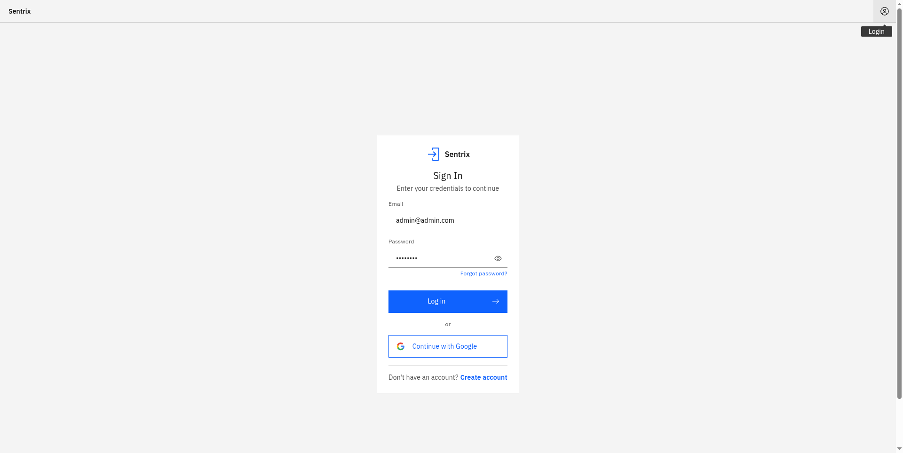

---

## 1. Dashboard Page

**Route:** `/dashboard`
**Location:** `ui/src/pages/dashboard/DashboardPage.tsx`

The main overview screen providing at-a-glance network health status. Uses role-based views.


### Role-Based Views

| Role | View Component | Key Widgets |
|------|---------------|-------------|
| `network-ops` | `NetworkOpsView.tsx` | KPIs, alerts over time chart, severity donut, recent alerts table, noisy devices, critical alert ticker |
| `sre` | `SREView.tsx` | MTTR, availability, incident trends, service health |
| `network-admin` | `NetworkAdminView.tsx` | Device inventory Carbon DataTable, health charts, pagination |
| `senior-eng` | `SeniorEngineerView.tsx` | Architecture-focused analytics, AI insights, pattern analysis |
| `sysadmin` | `SysAdminView.tsx` | User management DataTable (CRUD), per-user stats, expandable rows, bulk actions (activate/deactivate/delete/role-change), top performers, ticket distribution chart |

### Key Implementation Details

**Data Fetching (with polling):**
```typescript
useEffect(() => {
    const fetchData = async () => {
        const [summary, overTime, severity, alerts, devices, metrics] = await Promise.all([
            alertDataService.getAlertsSummary(),
            alertDataService.getAlertsOverTime(selectedTimePeriod),
            alertDataService.getSeverityDistribution(),
            alertDataService.getNocAlerts(),
            alertDataService.getNoisyDevices(),
            alertDataService.getAIMetrics()
        ]);
    };
    fetchData();
    const interval = setInterval(fetchData, 30000);
    return () => clearInterval(interval);
}, [selectedTimePeriod]);
```

**Theme Detection:**
```typescript
useEffect(() => {
    const detectTheme = () => {
        const themeSetting = document.documentElement.getAttribute('data-theme-setting');
        if (themeSetting === 'light') setCurrentTheme('white');
        else if (themeSetting === 'dark') setCurrentTheme('g100');
        else {
            const prefersDark = window.matchMedia('(prefers-color-scheme: dark)').matches;
            setCurrentTheme(prefersDark ? 'g100' : 'white');
        }
    };
    detectTheme();
    const observer = new MutationObserver(detectTheme);
    observer.observe(document.documentElement, { attributes: true, attributeFilter: ['data-theme-setting'] });
    return () => observer.disconnect();
}, []);
```

### Components Used

| Component | Import | Purpose |
|-----------|--------|---------|
| `Tile` | `@carbon/react` | Card containers |
| `DataTable` | `@carbon/react` | Alert list table |
| `StackedAreaChart` | `@carbon/charts-react` | Time series chart |
| `DonutChart` | `@carbon/charts-react` | Severity distribution |
| `KPICard` | `@/components` | Metric cards |
| `NoisyDevicesCard` | `@/components` | Device list |

---

## 2. Priority Alerts Page

**Route:** `/priority-alerts`
**Location:** `ui/src/pages/alerts/PriorityAlertsPage.tsx`

Focused view for managing critical and high-priority alerts with search, severity/status/time filters, quick filters, pagination, batch selection, and CSV export.


### Filter System

```typescript
const [searchQuery, setSearchQuery] = useState('');
const [selectedSeverity, setSelectedSeverity] = useState(SEVERITY_OPTIONS[0]);
const [selectedStatus, setSelectedStatus] = useState(STATUS_OPTIONS[0]);
const [selectedTime, setSelectedTime] = useState(TIME_OPTIONS[0]);
const [activeQuickFilters, setActiveQuickFilters] = useState<string[]>([]);
```

**Quick Filters:** `'Critical Only'`, `'Unacknowledged'`, `'My Devices'`, `'Repeated Alerts'`

### Table Columns

| Column | Content | Component |
|--------|---------|-----------|
| Select | Checkbox | `<Checkbox>` |
| Severity | Color-coded tag | `getSeverityTag()` |
| Timestamp | Relative + absolute | Custom cell |
| Device | Icon + name + IP | `getDeviceIcon()` |
| AI Summary | Title + summary | Custom cell |
| Status | Status tag | `getStatusTag()` |
| Confidence | Progress bar | `<ProgressBar>` |
| Actions | View, Acknowledge | `<Button>` icons |

---

## 3. Alert Details Page

**Route:** `/alerts/:id`
**Location:** `ui/src/pages/alerts/AlertDetailsPage.tsx`

Deep-dive view for a single alert with AI analysis and recommended actions.

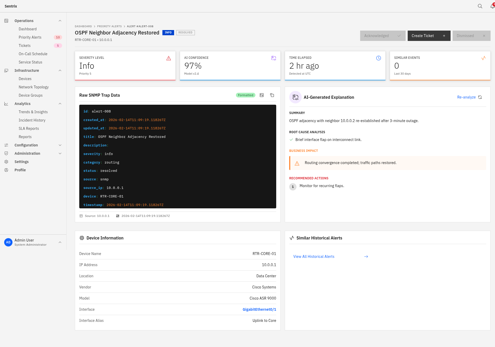

### Sub-Components

Located in `alerts/components/`:

| Component | Purpose |
|-----------|---------|
| `AIExplanation.tsx` | AI analysis summary, root causes list, business impact, recommended actions |
| `AlertActions.tsx` | Acknowledge, dismiss, resolve buttons + create ticket with assignee dropdown |
| `DeviceInfoCard.tsx` | Extended device info (vendor, model, location, interface) |
| `HistoricalAlerts.tsx` | Past incidents for this device with resolution history |
| `RawTrapData.tsx` | Raw SNMP/syslog data with copy-to-clipboard button |

---

## 4. Tickets Page

**Route:** `/tickets`
**Location:** `ui/src/pages/tickets/TicketsPage.tsx`

Issue tracking and ticket management with KPI cards (open/in-progress/resolved/avg resolution), create ticket modal, Carbon DataTable with search and filters.


### Create Ticket Modal

```tsx
<Modal open={isCreateModalOpen} modalHeading="Create New Ticket" ...>
    <TextInput id="create-ticket-title" labelText="Title" required />
    <TextArea id="create-ticket-description" labelText="Description" rows={4} />
    <Select id="create-ticket-priority" labelText="Priority">
        <SelectItem value="critical" text="Critical" />
        <SelectItem value="high" text="High" />
        <SelectItem value="medium" text="Medium" />
        <SelectItem value="low" text="Low" />
    </Select>
    <TextInput id="create-ticket-device" labelText="Device Name (optional)" />
    <Select id="create-ticket-assignee" labelText="Assigned To">
        {/* Dynamic assignees from users API */}
    </Select>
</Modal>
```

---

## 5. Ticket Details Page

**Route:** `/tickets/:id`
**Location:** `ui/src/pages/tickets/TicketDetailsPage.tsx`

Detailed view with real comments (GET/POST via `ticketService`), status change dropdown, delete with confirmation modal, linked alert navigation, dynamic assignee dropdown.

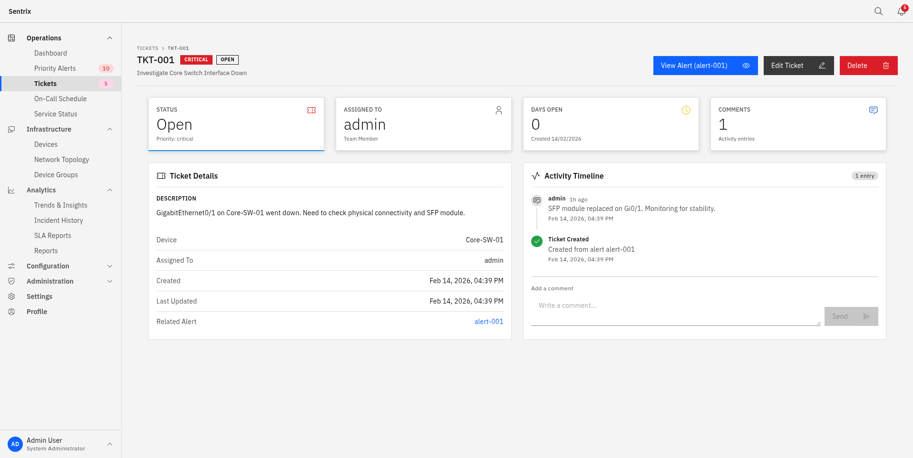

---

## 6. Device Explorer Page

**Route:** `/devices`
**Location:** `ui/src/pages/devices/DeviceExplorerPage.tsx`

Full device inventory with Carbon DataTable, health score progress bars, type/status filtering, and click-through to device details.

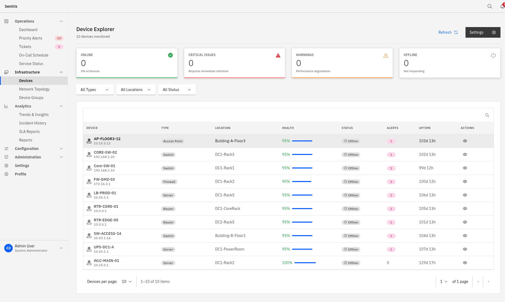

---

## 7. Device Details Page

**Route:** `/devices/:id`
**Location:** `ui/src/pages/devices/DeviceDetailsPage.tsx`

Device performance charts from real `GET /devices/:id/metrics` API with period selector (1h/6h/24h/7d). Shows CPU, memory, network utilization charts with realistic data (random walk, diurnal patterns, spikes).

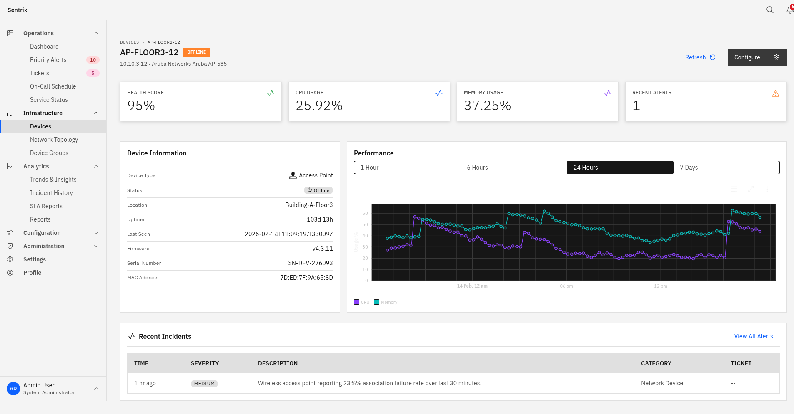

---

## 8. Device Groups Page

**Route:** `/device-groups`
**Location:** `ui/src/pages/devices/DeviceGroupsPage.tsx`

Device group management with color-coded cards, create/edit/delete modals, device multi-select assignment. 5 demo groups (Core Network, DMZ/Security, Edge Routing, Wireless Infrastructure, Data Center).

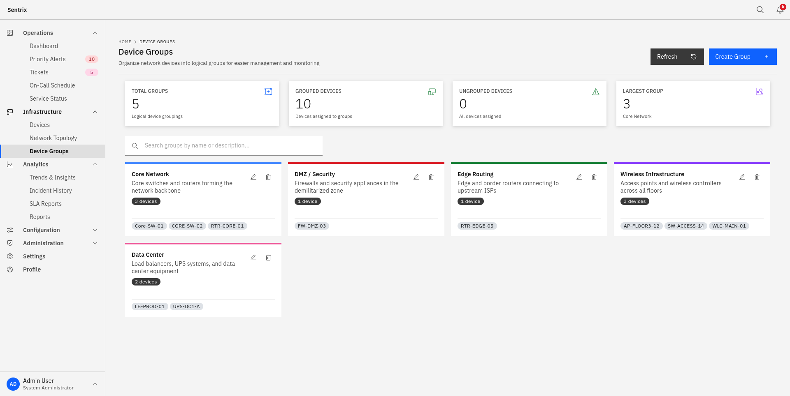

---

## 9. Configuration Page

**Route:** `/configuration`
**Location:** `ui/src/pages/configuration/ConfigurationPage.tsx`

Manages platform configuration across 4 tabs. All data persists to PostgreSQL via REST API.

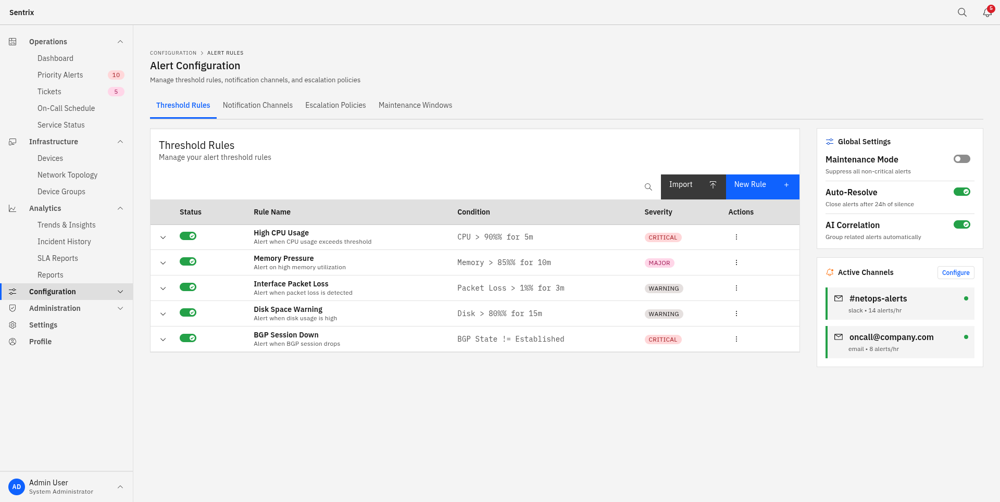

### Tabs

| Tab | API Endpoint | Features |
|-----|-------------|----------|
| Threshold Rules | `/api/v1/configuration/rules` | Structured condition builder (metric + operator + value) |
| Notification Channels | `/api/v1/configuration/channels` | Slack, Email, SMS, severity filter dropdown |
| Escalation Policies | `/api/v1/configuration/policies` | Multi-step alert escalation |
| Maintenance Windows | `/api/v1/configuration/maintenance` | Schedule builder (day + time + duration) |

Plus global settings (Maintenance Mode, Auto-resolve, AI Correlation) via `/configuration/global-settings`.

### Structured Inputs (No Free Text)

All modals use structured inputs to prevent human error:

**Threshold Rule Condition Builder:**
```tsx
<Select id="new-cond-metric" labelText="Metric">
    <SelectItem value="CPU" text="CPU Utilization" />
    <SelectItem value="Memory" text="Memory Usage" />
    <SelectItem value="Latency" text="Network Latency" />
</Select>
<Select id="new-cond-op" labelText="Operator">
    <SelectItem value=">" text=">" />
    <SelectItem value=">=" text=">=" />
</Select>
<NumberInput id="new-cond-value" label="Value" />
```

---

## 10. Settings Page

**Route:** `/settings`
**Location:** `ui/src/pages/settings/SettingsPage.tsx`

Three-tab layout: General (language, timezone, auto-refresh), Appearance & Role (theme selection, role switcher for 5 dashboard views), Notifications (email/push/sound/critical-only toggles).

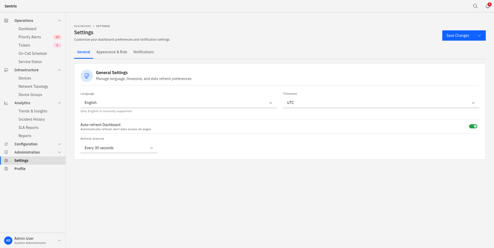

---

## 11. Trends & Insights Page

**Route:** `/trends`
**Location:** `ui/src/pages/trends/TrendsPage.tsx`

Historical analysis and AI-powered pattern detection.

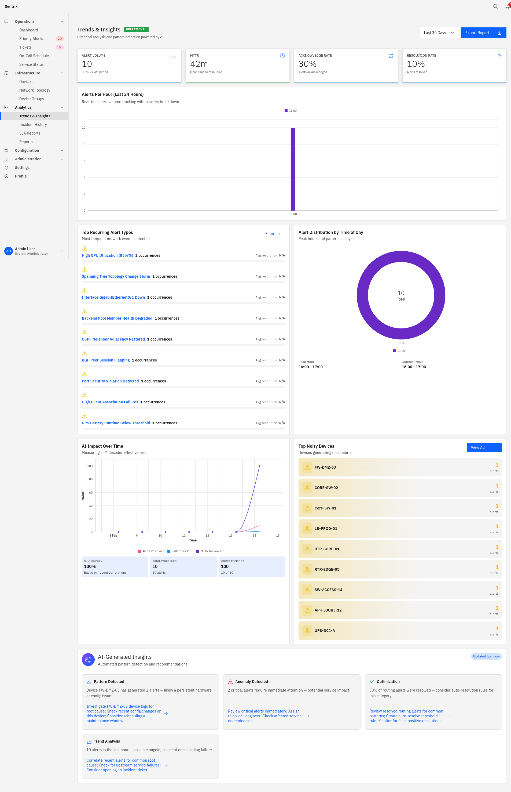

**Sections:**
- KPI cards (alert volume, MTTR, recurring alerts %, escalation rate)
- Alerts-per-hour stacked bar chart (by severity)
- Severity distribution donut chart
- Recurring alerts list with severity filter popover
- AI insights cards (pattern, optimization, recommendation)
- Peak/quietest hours (from real API data)
- Noisy devices (gradient variant)

---

## 12. Incident History Page

**Route:** `/incident-history`
**Location:** `ui/src/pages/incidents/IncidentHistoryPage.tsx`

Resolved incidents with MTTR metric, SLA compliance, root cause breakdown charts. Expandable rows show prevention actions and report button. Uses `EmptyState` component when no incidents found.

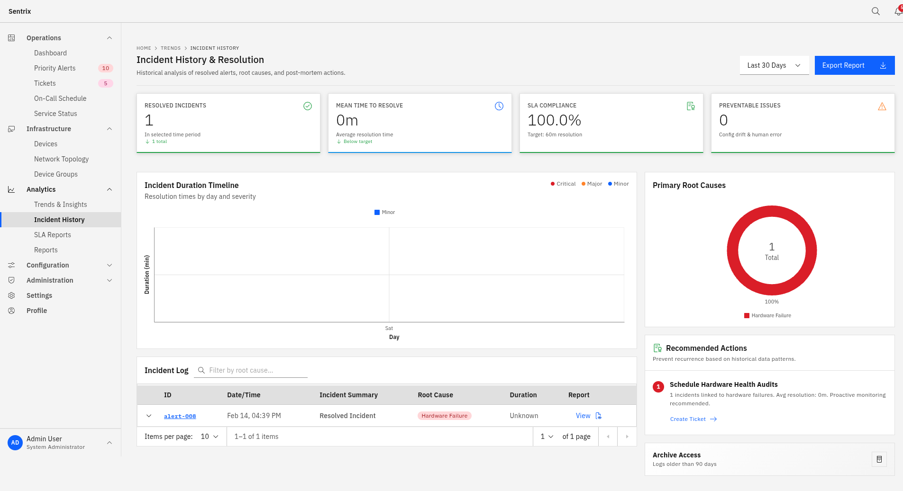

---

## 13. Reports Hub Page

**Route:** `/reports`
**Location:** `ui/src/pages/reports/ReportsHubPage.tsx`

5 report types (Alert Summary, Ticket Analytics, SLA Compliance, Incident Report, Device Health), CSV download via blob URL, localStorage-based download history tracking.

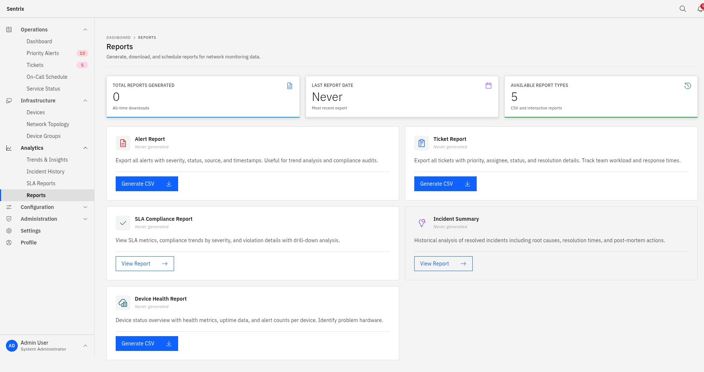

---

## 14. SLA Reports Page

**Route:** `/reports/sla`
**Location:** `ui/src/pages/reports/SLAReportsPage.tsx`

SLA compliance KPIs, trend line chart over time, violations DataTable with severity tags. Dedicated `_sla-reports.scss` stylesheet.

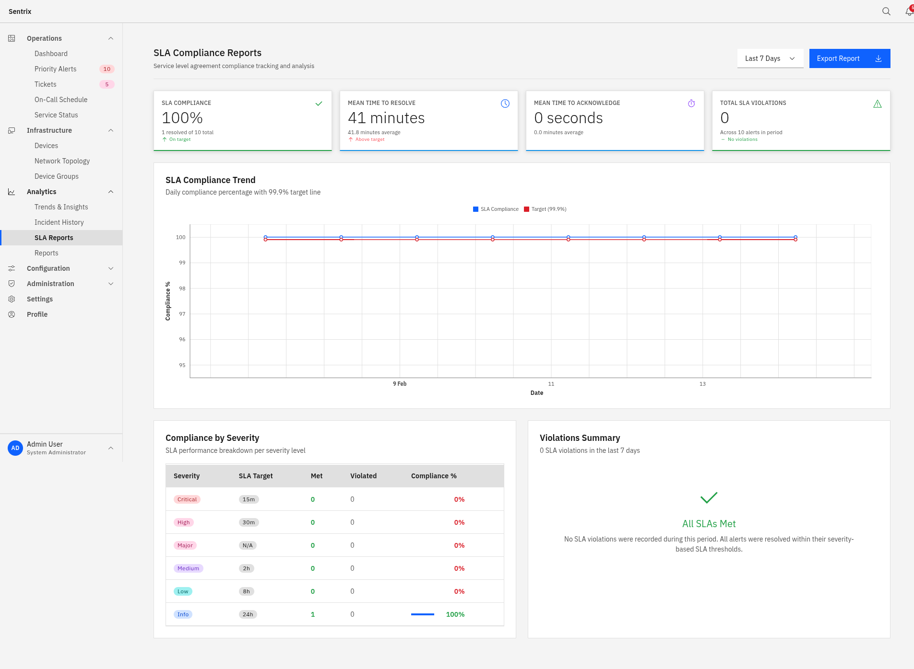

---

## 15. On-Call Page

**Route:** `/on-call`
**Location:** `ui/src/pages/oncall/OnCallPage.tsx`

Current on-call engineer with contact info, weekly schedule grid view, override history. Data from `GET /on-call/current` and `GET /on-call/schedule` (demo mode).

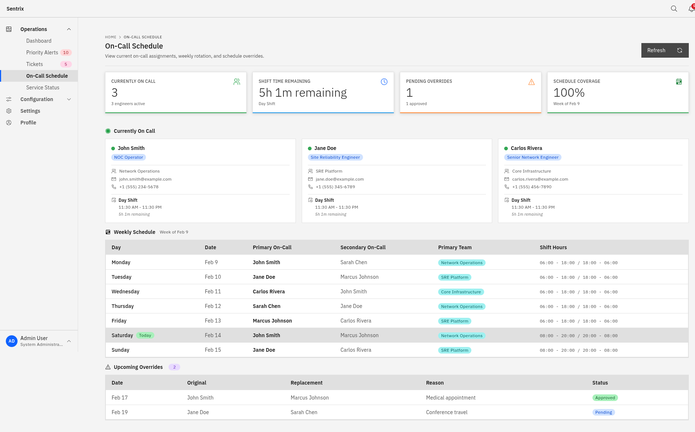

---

## 16. Topology Page

**Route:** `/topology`
**Location:** `ui/src/pages/topology/TopologyPage.tsx`

Network topology visualization with nodes and connection lines, connections DataTable with source/target/type/status, device type filtering. Data from `GET /topology` (demo mode with nodes + edges).

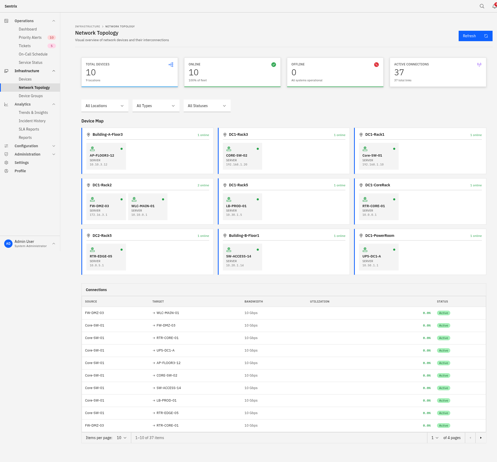

---

## 17. Service Status Page

**Route:** `/service-status`
**Location:** `ui/src/pages/service-status/ServiceStatusPage.tsx`

Real Docker container monitoring via `GET /services/status`. Container status cards with health indicators, log viewer modal via `GET /services/:name/logs`, auto-refresh toggle. Falls back to application-level health checks when Docker is unavailable.

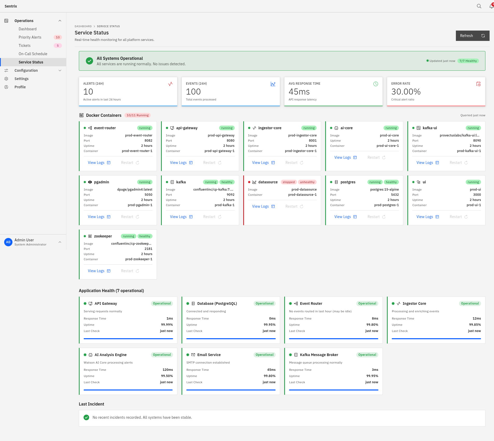

---

## 18. Runbooks Page

**Route:** `/runbooks`
**Location:** `ui/src/pages/runbooks/RunbooksPage.tsx`

Knowledge base with search, category filter (Networking, Security, Database, System, Cloud, General), card layout with severity badges, create/edit/view modals with step editor, RBAC (sysadmin/senior-eng for write operations). 10 demo runbooks seeded via backend.

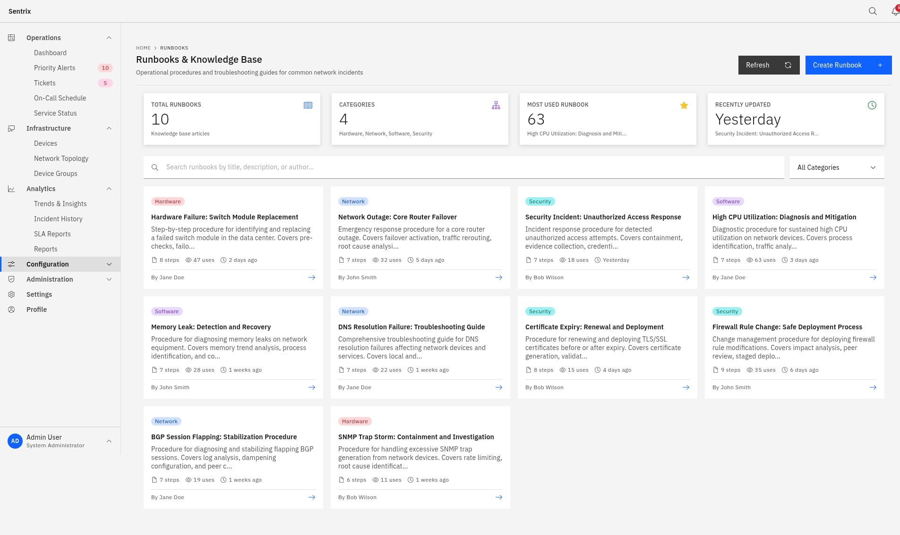

---

## 19. Audit Log Page

**Route:** `/admin/audit-log`
**Location:** `ui/src/pages/admin/AuditLogPage.tsx`

**Access:** sysadmin role only.

KPI cards (total events, unique users, failed actions), real data from `GET /audit-logs` (wired to `audit_logs` PostgreSQL table), Carbon DataTable with date range filter, action type filter, username search, CSV export button.

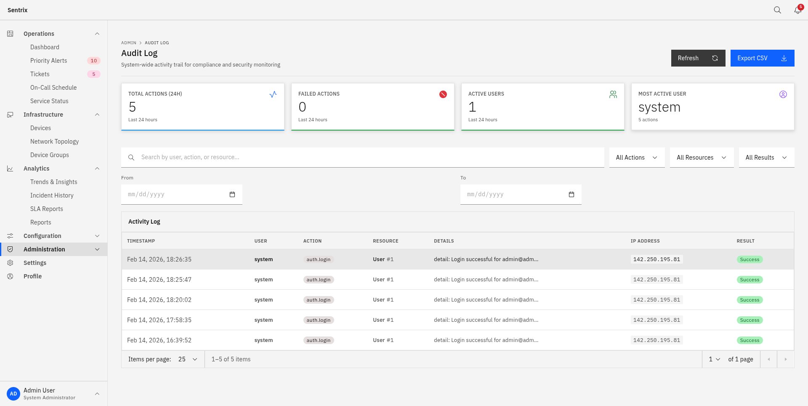

---

## 20. Profile Page

**Route:** `/profile`
**Location:** `ui/src/pages/profile/ProfilePage.tsx`

Profile header card with avatar and role badge, account details form (first name, last name, email), password change form (current + new + confirm). Uses `PUT /me` and `PUT /me/password` APIs.

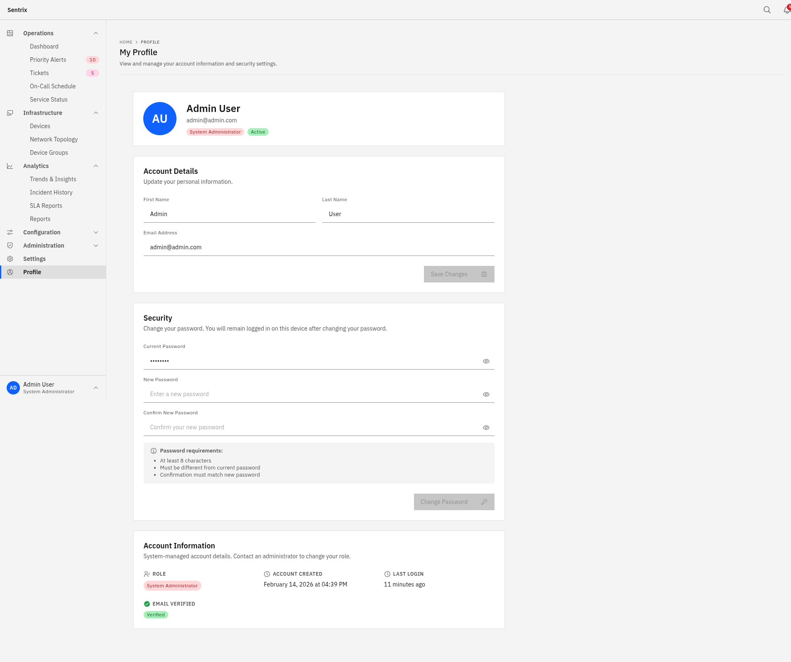

---

## Constants & Helpers

**Location:** `ui/src/shared/constants/alerts.tsx`

### Severity Configuration

```typescript
export type Severity = 'critical' | 'major' | 'minor' | 'info';

export const SEVERITY_CONFIG: Record<Severity, SeverityConfig> = {
    critical: { label: 'Critical', color: '#da1e28', tagType: 'red', icon: ErrorFilled, priority: 1 },
    major: { label: 'Major', color: '#ff832b', tagType: 'magenta', icon: WarningFilled, priority: 2 },
    minor: { label: 'Minor', color: '#f1c21b', tagType: 'purple', icon: WarningAlt, priority: 3 },
    info: { label: 'Info', color: '#4589ff', tagType: 'blue', icon: InformationFilled, priority: 4 },
};
```

### Status Configuration

```typescript
export type AlertStatus = 'new' | 'acknowledged' | 'in-progress' | 'resolved' | 'dismissed';

export const STATUS_CONFIG: Record<AlertStatus, StatusConfig> = {
    new: { label: 'New', tagType: 'teal' },
    acknowledged: { label: 'Acknowledged', tagType: 'blue' },
    'in-progress': { label: 'In Progress', tagType: 'cyan' },
    resolved: { label: 'Resolved', tagType: 'green' },
    dismissed: { label: 'Dismissed', tagType: 'gray' },
};
```

### Helper Functions

```typescript
export function getSeverityTag(severity: Severity, size: 'sm' | 'md' = 'sm'): ReactElement;
export function getStatusTag(status: AlertStatus, size: 'sm' | 'md' = 'sm'): ReactElement;
export function getSeverityIcon(severity: Severity, size: number = 24): ReactElement;
export function getDeviceIcon(icon: DeviceIcon, size: number = 20): ReactElement;
export function sortBySeverity<T extends { severity: Severity }>(items: T[]): T[];
```

### Chart Options Factory

```typescript
import { createAreaChartOptions, createDonutChartOptions } from '@/shared/constants/charts';

const options = createAreaChartOptions({
    title: 'Alerts Over Time',
    height: '320px',
    theme: currentTheme,  // 'white' or 'g100'
});
```

---

## Loading States

All pages use Carbon Design System skeleton components for loading states.

```tsx
import { SkeletonText, SkeletonPlaceholder, DataTableSkeleton, Tile } from '@carbon/react';

if (isLoading) {
    return (
        <div className="page">
            <div className="page-header">
                <SkeletonText heading width="200px" />
                <SkeletonText width="350px" />
            </div>
            <div className="kpi-row">
                {[1, 2, 3, 4].map((i) => (
                    <Tile key={i} className="kpi-card-skeleton">
                        <SkeletonText width="60%" />
                        <SkeletonText heading width="40%" />
                    </Tile>
                ))}
            </div>
            <DataTableSkeleton columnCount={6} rowCount={5} showHeader showToolbar />
        </div>
    );
}
```

---

## Theming

The UI supports three theme modes using Carbon Design System tokens.

### Theme Modes

1. **Light** - `data-theme-setting="light"` (Carbon `white`)
2. **Dark** - `data-theme-setting="dark"` (Carbon `g100`)
3. **System** - Follows OS preference

### CSS Variables

```scss
.my-component {
    background: var(--cds-layer-01);
    color: var(--cds-text-primary);
    border-color: var(--cds-border-subtle);
}

.severity-critical { color: var(--cds-support-error); }
.severity-major { color: var(--cds-support-warning); }
.severity-minor { color: var(--cds-support-caution); }
.severity-info { color: var(--cds-support-info); }
```

---

## Data Service

**Pattern:** Interface -> MockService -> APIService -> factory -> singleton export.

```typescript
import { alertDataService } from '@/features/alerts/services/alertService';

const alerts = await alertDataService.getAlerts();
const summary = await alertDataService.getAlertsSummary();
const alert = await alertDataService.getAlertById('alert-001');
```

**Environment Switching:**
```bash
npm run dev                    # Mock data (default)
VITE_USE_MOCK=false npm run dev  # Real API
npm run build                  # Real API (production)
```

---

## Sidebar Navigation (AppHeader.tsx)

Grouped using Carbon `SideNavMenu`:

| Group | Items |
|-------|-------|
| **Operations** | Dashboard, Priority Alerts, Tickets, On-Call Schedule, Service Status |
| **Infrastructure** | Devices, Device Groups, Network Topology |
| **Analytics** | Trends, Incident History, SLA Reports, Reports Hub |
| **Configuration** | Alert Configuration, Runbooks |
| **Administration** | Audit Log (sysadmin only) |
| **Bottom** | Settings, Profile |

---

## E2E Testing

### Running Tests

```bash
npm test                    # Against Docker (port 3000)
BASE_URL=http://localhost:5173 npm test  # Against dev server
npm run test:config         # Configuration page tests
npm run test:tickets        # Tickets page tests
npm run test:validation     # Input validation tests
npm run test:headed         # With browser UI visible
npm run test:report         # View HTML report
```

### Test Coverage

| Suite | Tests | Coverage |
|-------|-------|----------|
| `configuration.spec.ts` | 10 | CRUD for all 4 config tabs, edit modal parsing, rule toggles |
| `tickets.spec.ts` | 9 | Create/edit tickets, alert ComboBox, assignee Select, title validation |
| `input-validation.spec.ts` | 11 | Structured inputs (dropdowns not free text), required field validation |
| **Total** | **30** | All modals, all structured inputs, all required fields |

### Helper Functions

```typescript
import { login, clickModalPrimary, clickModalSecondary, visibleModal } from './helpers/auth';

await login(page);                              // Login with retry logic (3 attempts)
await login(page, 'custom@email.com', 'pass');  // Custom credentials
await clickModalPrimary(page);                  // Click submit/save button
const modal = visibleModal(page);               // Get currently visible modal
```
