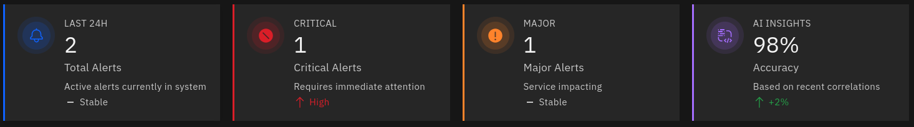
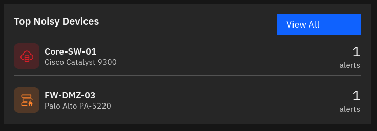
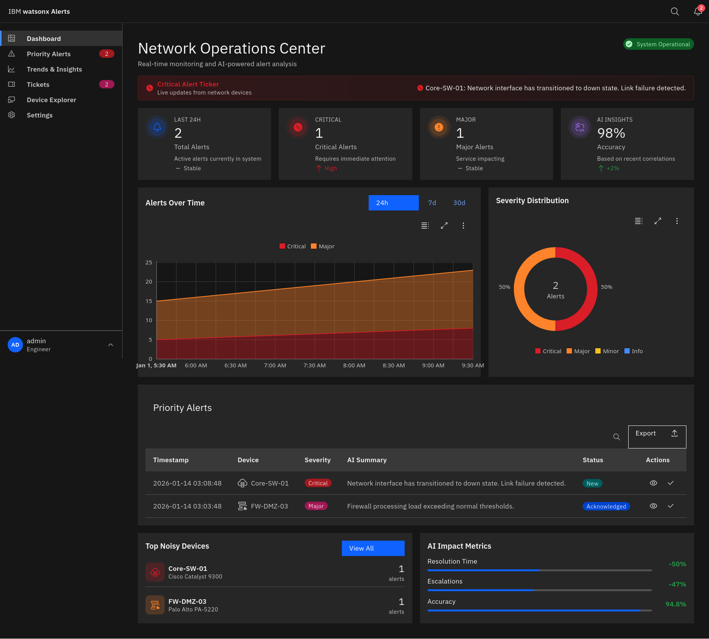
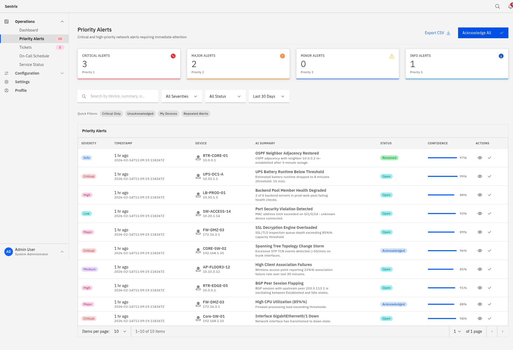
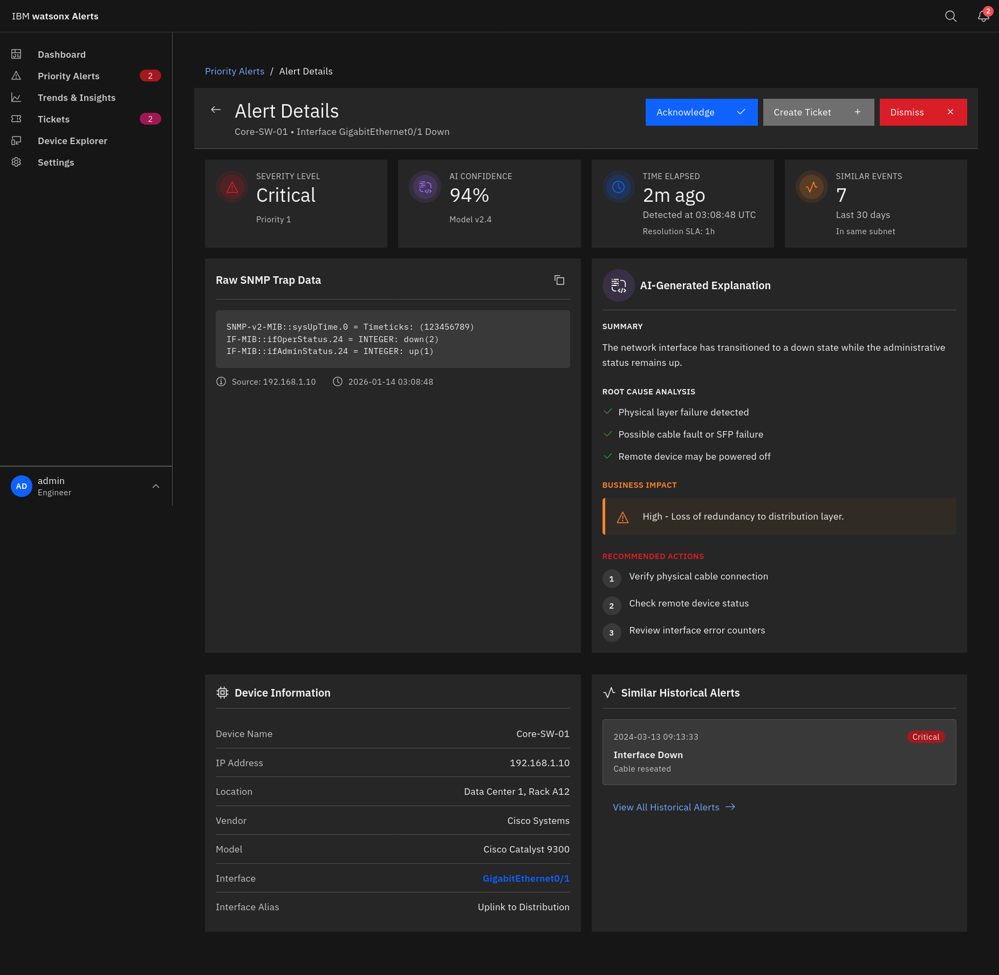
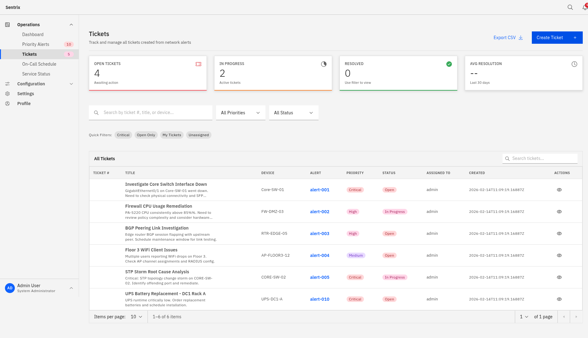
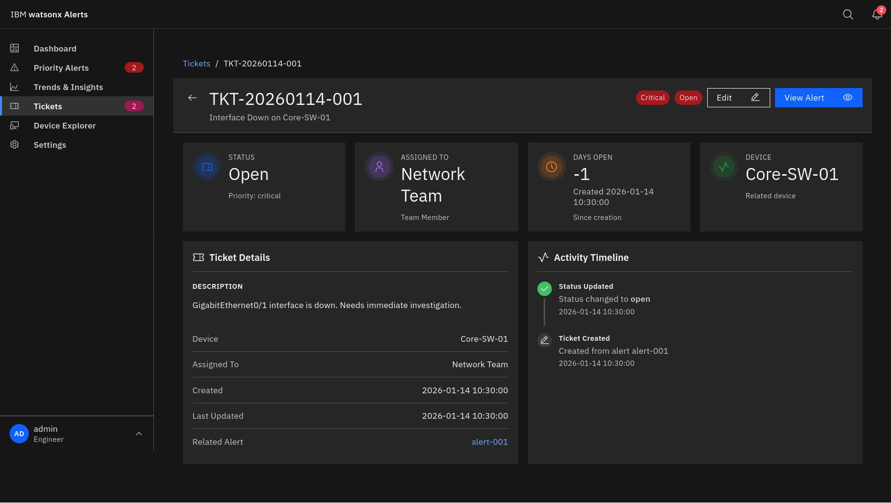
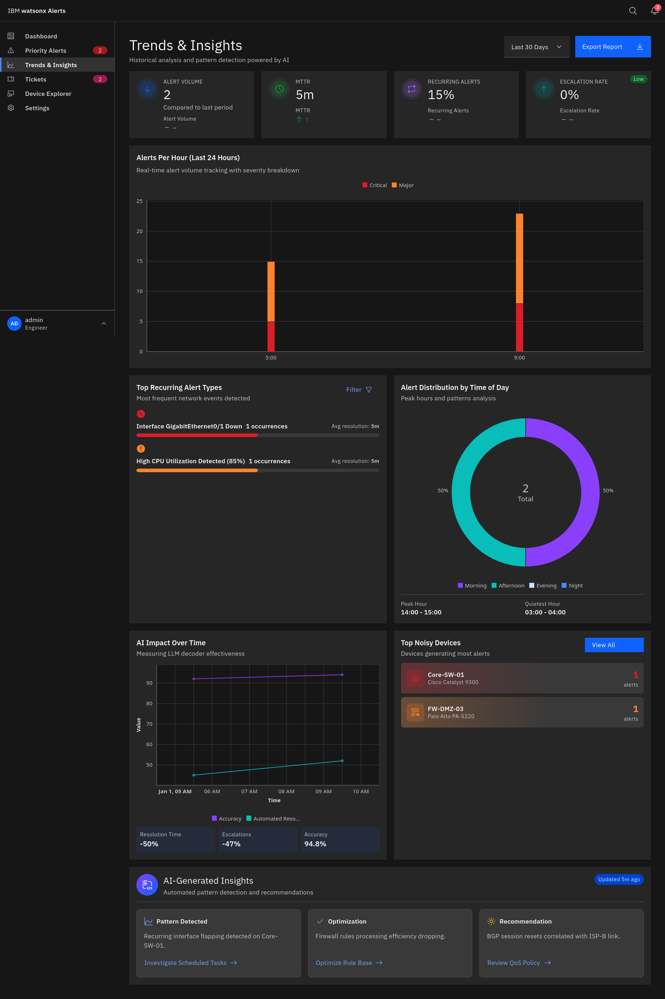

# UI Screens & Components Reference

Complete developer guide for all screens, components, and patterns in the NOC Dashboard UI.

## Table of Contents

1. [Project Structure](#project-structure)
2. [Shared Components](#shared-components)
3. [Dashboard Page](#1-dashboard-page)
4. [Priority Alerts Page](#2-priority-alerts-page)
5. [Alert Details Page](#3-alert-details-page)
6. [Tickets Page](#4-tickets-page)
7. [Ticket Details Page](#5-ticket-details-page)
8. [Trends & Insights Page](#6-trends--insights-page)
9. [Constants & Helpers](#constants--helpers)
10. [Loading States](#loading-states)
11. [Theming](#theming)

---

## Project Structure

```
ui/src/
├── __mocks__/              # Mock data for development
│   └── alerts.mock.ts      # Alert, device, ticket mock data
├── components/
│   ├── alerts/             # Alert-specific components
│   │   ├── AlertActions.tsx
│   │   └── AlertDetailsPage.tsx
│   ├── auth/               # Authentication components
│   ├── common/             # Common UI elements
│   ├── dashboard/          # Dashboard-specific components
│   ├── layout/             # App layout (Header, Sidebar)
│   │   ├── AppHeader.tsx
│   │   ├── AppSidebar.tsx
│   │   └── AppLayout.tsx
│   └── shared/             # Reusable components
│       ├── KPICard.tsx
│       ├── NoisyDevicesCard.tsx
│       └── ChartWrapper.tsx
├── config/
│   └── environment.ts      # Environment configuration
├── constants/
│   └── alerts.tsx          # Types, configs, helpers
├── hooks/                  # Custom React hooks
│   ├── useAlert.ts
│   └── useRealTimeAlerts.ts
├── pages/                  # Page components
│   ├── dashboard/
│   ├── priority-alerts/
│   ├── tickets/
│   ├── ticket-details/
│   └── trends-insights/
├── services/
│   └── AlertDataService.ts # Data layer (Mock/API)
└── styles/                 # SCSS styles
    ├── index.scss
    ├── DashboardPage.scss
    ├── KPICard.scss
    └── ...
```

---

## Shared Components

### KPICard

A reusable metric display card with icon, value, trend indicator, and optional badge.

**Location:** `ui/src/components/shared/KPICard.tsx`

**Props Interface:**
```typescript
interface KPICardProps {
    id?: string;
    label: string;                    // Card title (e.g., "Active Alerts")
    value: string | number;           // Main metric value
    subtitle?: string;                // Secondary text below value
    footnote?: string;                // Small text at bottom
    trend?: {
        sentiment: 'positive' | 'negative' | 'neutral';  // Color: green/red/gray
        direction: 'up' | 'down' | 'flat';               // Arrow direction
        value: string;                                    // Trend text (e.g., "-12%")
    };
    IconComponent: CarbonIconType;    // Carbon icon component
    color: 'blue' | 'red' | 'orange' | 'yellow' | 'green' | 'purple' | 'teal';
    badge?: {
        text: string;                 // Badge label
        type: 'red' | 'magenta' | 'purple' | 'blue' | 'green' | 'gray';
    };
    borderedSeverity?: 'red' | 'orange' | 'yellow' | 'green' | 'blue' | 'purple' | 'teal';
}
```

**Usage Example:**
```tsx
import { KPICard } from '@/components';
import { Notification } from '@carbon/icons-react';

<KPICard
    id="active-alerts"
    label="Active Alerts"
    value={156}
    subtitle="Last 24 hours"
    trend={{
        sentiment: 'negative',
        direction: 'up',
        value: '+12%'
    }}
    IconComponent={Notification}
    color="red"
    badge={{ text: 'High', type: 'red' }}
/>
```

**Visual Structure:**
**Visual Structure:**



**Styling:** `ui/src/styles/KPICard.scss`


---

### NoisyDevicesCard

Displays top devices generating the most alerts with severity indicators.

**Location:** `ui/src/components/shared/NoisyDevicesCard.tsx`

**Props Interface:**
```typescript
interface NoisyDeviceItem {
    device: {
        name: string;
        ip: string;
        icon: 'switch' | 'firewall' | 'router' | 'server' | 'wireless';
        model?: string;
    };
    model?: string;
    alertCount: number;
    severity: 'critical' | 'major' | 'minor' | 'info';
}

interface NoisyDevicesCardProps {
    title?: string;              // Default: "Top Noisy Devices"
    subtitle?: string;
    devices: NoisyDeviceItem[];
    variant?: 'simple' | 'gradient';  // Visual style for Trends page
    showViewAll?: boolean;       // Show "View All" button
    onViewAll?: () => void;      // Custom handler
}
```

**Usage Example:**
```tsx
import { NoisyDevicesCard } from '@/components';

// Simple variant (Dashboard)
<NoisyDevicesCard
    title="Top Noisy Devices"
    devices={noisyDevices}
    variant="simple"
/>

// Gradient variant (Trends page) - with severity-colored backgrounds
<NoisyDevicesCard
    title="Top Noisy Devices"
    subtitle="Devices generating most alerts"
    devices={noisyDevices}
    variant="gradient"
    showViewAll
/>
```

**Visual Structure:**
**Visual Structure:**



---

### ChartWrapper

A wrapper component for Carbon Charts that handles responsive sizing and error boundaries.

**Location:** `ui/src/components/shared/ChartWrapper.tsx`

**Usage:**
```tsx
import { ChartWrapper } from '@/components/shared/ChartWrapper';
import { DonutChart, StackedAreaChart } from '@carbon/charts-react';

<ChartWrapper
    ChartComponent={DonutChart}
    data={severityDistribution}
    options={donutOptions}
    height="300px"
/>
```

---

## 1. Dashboard Page

**Route:** `/`
**Location:** `ui/src/pages/dashboard/index.tsx`

The main overview screen providing at-a-glance network health status.

### Layout Structure


### Key Implementation Details

**State Management:**
```typescript
const [selectedTimePeriod, setSelectedTimePeriod] = useState<'24h' | '7d' | '30d'>('24h');
const [currentTheme, setCurrentTheme] = useState('g100');
const [isLoading, setIsLoading] = useState(true);

// Data State
const [kpiData, setKpiData] = useState<KPICardData[]>([]);
const [alertsOverTimeData, setAlertsOverTimeData] = useState<any[]>([]);
const [severityDist, setSeverityDist] = useState<any[]>([]);
const [recentAlerts, setRecentAlerts] = useState<SummaryAlert[]>([]);
const [noisyDevices, setNoisyDevices] = useState<NoisyDevice[]>([]);
const [aiMetrics, setAiMetrics] = useState<AIMetric[]>([]);
```

**Data Fetching (with polling):**
```typescript
useEffect(() => {
    const fetchData = async () => {
        try {
            setIsLoading(true);
            const [summary, overTime, severity, alerts, devices, metrics] = await Promise.all([
                alertDataService.getAlertsSummary(),
                alertDataService.getAlertsOverTime(selectedTimePeriod),
                alertDataService.getSeverityDistribution(),
                alertDataService.getNocAlerts(),
                alertDataService.getNoisyDevices(),
                alertDataService.getAIMetrics()
            ]);
            // ... set state
        } finally {
            setIsLoading(false);
        }
    };

    fetchData();
    const interval = setInterval(fetchData, 30000); // Poll every 30s
    return () => clearInterval(interval);
}, [selectedTimePeriod]);
```

**Theme Detection:**
```typescript
useEffect(() => {
    const detectTheme = () => {
        const themeSetting = document.documentElement.getAttribute('data-theme-setting');
        if (themeSetting === 'light') setCurrentTheme('white');
        else if (themeSetting === 'dark') setCurrentTheme('g100');
        else {
            const prefersDark = window.matchMedia('(prefers-color-scheme: dark)').matches;
            setCurrentTheme(prefersDark ? 'g100' : 'white');
        }
    };
    detectTheme();
    const observer = new MutationObserver(detectTheme);
    observer.observe(document.documentElement, {
        attributes: true,
        attributeFilter: ['data-theme-setting']
    });
    return () => observer.disconnect();
}, []);
```

**Chart Options Factory:**
```typescript
const areaChartOptions = useMemo(() => createAreaChartOptions({
    title: 'Alerts Over Time',
    height: '320px',
    theme: currentTheme,
    showTitle: false,
}), [currentTheme]);
```

### Critical Alert Ticker

An animated, clickable component that displays critical alerts with automatic rotation.

**Features:**
- Automatically rotates through critical alerts every 5 seconds
- Smooth slide-in animation on alert change
- Clickable to navigate to alert details
- Visual indicators (dots) show multiple alerts
- Keyboard accessible (Enter/Space)

**Implementation:**
```typescript
// Filter critical alerts and limit to 5
const tickerAlerts = useMemo(() =>
    recentAlerts.filter(a => a.severity === 'critical').slice(0, 5),
    [recentAlerts]
);

const [currentTickerIndex, setCurrentTickerIndex] = useState(0);

// Auto-rotate every 5 seconds
useEffect(() => {
    if (tickerAlerts.length <= 1) {
        setCurrentTickerIndex(0);
        return;
    }
    const interval = setInterval(() => {
        setCurrentTickerIndex((prev) => (prev + 1) % tickerAlerts.length);
    }, 5000);
    return () => clearInterval(interval);
}, [tickerAlerts.length]);

const currentAlert = tickerAlerts[currentTickerIndex];
```

**JSX Structure:**
```tsx
<div className="critical-alert-ticker">
    <div className="ticker-label">
        <CriticalIcon size={16} />
        <div className="ticker-text-group">
            <span className="ticker-title">Critical Alert</span>
            <span className="ticker-subtitle">Live updates • Click to view</span>
        </div>
    </div>
    <div className="ticker-alerts">
        {tickerAlerts.length > 0 && currentAlert ? (
            <div
                key={currentTickerIndex}
                className="alert-item-animated"
                onClick={() => navigate(`/alerts/${currentAlert.id}`)}
                role="button"
                tabIndex={0}
            >
                <div className="alert-content">
                    <CriticalIcon size={16} />
                    <div className="alert-text">
                        <span className="alert-device">{currentAlert.device?.name}</span>
                        <span className="alert-separator">:</span>
                        <span className="alert-message">{currentAlert.aiSummary}</span>
                    </div>
                </div>
                {tickerAlerts.length > 1 && (
                    <div className="ticker-indicator">
                        {tickerAlerts.map((_, index) => (
                            <span
                                key={index}
                                className={`indicator-dot ${index === currentTickerIndex ? 'active' : ''}`}
                            />
                        ))}
                    </div>
                )}
            </div>
        ) : (
            <span className="alert-item-no-alerts">
                <CheckmarkFilled size={16} />
                No active critical alerts
            </span>
        )}
    </div>
</div>
```

**Styling:** `ui/src/styles/DashboardPage.scss`

```scss
.alert-item-animated {
    cursor: pointer;
    animation: slideIn 0.5s ease-out;
    transition: all 0.3s ease;
    &:hover { transform: translateY(-1px); }
}

@keyframes slideIn {
    from { opacity: 0; transform: translateX(-20px); }
    to { opacity: 1; transform: translateX(0); }
}
```

### Components Used

| Component | Import | Purpose |
|-----------|--------|---------|
| `Tile` | `@carbon/react` | Card containers |
| `DataTable` | `@carbon/react` | Alert list table |
| `Button` | `@carbon/react` | Actions, time period toggle |
| `ProgressBar` | `@carbon/react` | AI metrics visualization |
| `StackedAreaChart` | `@carbon/charts-react` | Time series chart |
| `DonutChart` | `@carbon/charts-react` | Severity distribution |
| `KPICard` | `@/components` | Metric cards |
| `NoisyDevicesCard` | `@/components` | Device list |

### Actions

```typescript
// Navigate to alert details
const handleViewAlert = (alertId: string) => {
    navigate(`/alerts/${alertId}`);
};

// Acknowledge an alert
const handleAcknowledgeAlert = async (alertId: string) => {
    await alertDataService.acknowledgeAlert(alertId);
    const updatedAlerts = await alertDataService.getNocAlerts();
    setRecentAlerts(updatedAlerts);
};

// Export report
const handleExport = async () => {
    await alertDataService.exportReport('csv');
};
```


---

## 2. Priority Alerts Page

**Route:** `/priority-alerts`
**Location:** `ui/src/pages/priority-alerts/index.tsx`

Focused view for managing critical and high-priority alerts.

### Layout Structure


### Filter System Implementation

**Filter State:**
```typescript
// Search and dropdown filters
const [searchQuery, setSearchQuery] = useState('');
const [selectedSeverity, setSelectedSeverity] = useState(SEVERITY_OPTIONS[0]);
const [selectedStatus, setSelectedStatus] = useState(STATUS_OPTIONS[0]);
const [selectedTime, setSelectedTime] = useState(TIME_OPTIONS[0]);

// Quick filter tags
const [activeQuickFilters, setActiveQuickFilters] = useState<string[]>([]);

// Pagination
const [currentPage, setCurrentPage] = useState(1);
const [pageSize, setPageSize] = useState(10);

// Row selection for bulk actions
const [selectedRows, setSelectedRows] = useState<Set<string>>(new Set());
```

**Filter Options:**
```typescript
const SEVERITY_OPTIONS = [
    { id: 'all', text: 'All Severities' },
    { id: 'critical', text: 'Critical' },
    { id: 'major', text: 'Major' },
    { id: 'minor', text: 'Minor' },
    { id: 'info', text: 'Info' },
];

const STATUS_OPTIONS = [
    { id: 'all', text: 'All Status' },
    { id: 'new', text: 'New' },
    { id: 'acknowledged', text: 'Acknowledged' },
    { id: 'in-progress', text: 'In Progress' },
    { id: 'resolved', text: 'Resolved' },
];

const TIME_OPTIONS = [
    { id: '24h', text: 'Last 24 Hours' },
    { id: '7d', text: 'Last 7 Days' },
    { id: '30d', text: 'Last 30 Days' },
];

const QUICK_FILTERS = ['Critical Only', 'Unacknowledged', 'My Devices', 'Repeated Alerts'];
```

**Filtering Logic (useMemo):**
```typescript
const filteredAlerts = useMemo(() => {
    let result = [...alerts];

    // Text search
    if (searchQuery) {
        const query = searchQuery.toLowerCase();
        result = result.filter(alert =>
            alert.device.name.toLowerCase().includes(query) ||
            alert.device.ip.toLowerCase().includes(query) ||
            alert.aiSummary.toLowerCase().includes(query) ||
            alert.aiTitle.toLowerCase().includes(query)
        );
    }

    // Dropdown filters
    if (selectedSeverity.id !== 'all') {
        result = result.filter(alert => alert.severity === selectedSeverity.id);
    }

    if (selectedStatus.id !== 'all') {
        result = result.filter(alert => alert.status === selectedStatus.id);
    }

    // Quick filters
    if (activeQuickFilters.includes('Critical Only')) {
        result = result.filter(alert => alert.severity === 'critical');
    }

    if (activeQuickFilters.includes('Unacknowledged')) {
        result = result.filter(alert => alert.status === 'new');
    }

    if (activeQuickFilters.includes('My Devices')) {
        const myDevices = ['Core-SW-01', 'FW-DMZ-03', 'RTR-EDGE-05'];
        result = result.filter(alert => myDevices.includes(alert.device.name));
    }

    if (activeQuickFilters.includes('Repeated Alerts')) {
        const alertCounts = new Map<string, number>();
        alerts.forEach(a => alertCounts.set(a.aiTitle, (alertCounts.get(a.aiTitle) || 0) + 1));
        result = result.filter(alert => (alertCounts.get(alert.aiTitle) || 0) > 1);
    }

    return result;
}, [alerts, searchQuery, selectedSeverity, selectedStatus, activeQuickFilters]);
```

**Pagination:**
```typescript
const paginatedAlerts = useMemo(() => {
    const start = (currentPage - 1) * pageSize;
    return filteredAlerts.slice(start, start + pageSize);
}, [filteredAlerts, currentPage, pageSize]);
```

**Quick Filter Toggle:**
```typescript
const toggleQuickFilter = (filter: string) => {
    setActiveQuickFilters(prev =>
        prev.includes(filter)
            ? prev.filter(f => f !== filter)
            : [...prev, filter]
    );
    setCurrentPage(1); // Reset to first page
};
```

**Clear All Filters:**
```typescript
const clearAllFilters = () => {
    setSearchQuery('');
    setSelectedSeverity(SEVERITY_OPTIONS[0]);
    setSelectedStatus(STATUS_OPTIONS[0]);
    setSelectedTime(TIME_OPTIONS[0]);
    setActiveQuickFilters([]);
    setCurrentPage(1);
};
```

### Filter UI Components

**Search Input:**
```tsx
<Search
    size="lg"
    placeholder="Search by device, summary, or title..."
    labelText="Search alerts"
    value={searchQuery}
    onChange={(e) => {
        setSearchQuery(e.target.value);
        setCurrentPage(1);
    }}
    onClear={() => {
        setSearchQuery('');
        setCurrentPage(1);
    }}
    className="filters-search"
/>
```

**Dropdown Filter:**
```tsx
<Dropdown
    id="severity-filter"
    label="Severity"
    titleText=""
    items={SEVERITY_OPTIONS}
    itemToString={(item) => item?.text || ''}
    selectedItem={selectedSeverity}
    onChange={({ selectedItem }) => {
        setSelectedSeverity(selectedItem || SEVERITY_OPTIONS[0]);
        setCurrentPage(1);
    }}
    size="lg"
/>
```

**Quick Filter Tags:**
```tsx
<div className="quick-filters">
    <span className="quick-filters-label">Quick Filters:</span>
    {QUICK_FILTERS.map((filter) => (
        <Tag
            key={filter}
            type={activeQuickFilters.includes(filter) ? 'blue' : 'gray'}
            onClick={() => toggleQuickFilter(filter)}
            className="quick-filter-tag"
        >
            {filter}
        </Tag>
    ))}
</div>
```

**Clear Filters Button:**
```tsx
{hasActiveFilters && (
    <Button
        kind="ghost"
        size="lg"
        renderIcon={Close}
        onClick={clearAllFilters}
    >
        Clear filters ({activeFilterCount})
    </Button>
)}
```

### Table Columns

| Column | Content | Component |
|--------|---------|-----------|
| Select | Checkbox | `<Checkbox>` |
| Severity | Color-coded tag | `getSeverityTag()` |
| Timestamp | Relative + absolute | Custom cell |
| Device | Icon + name + IP | `getDeviceIcon()` |
| AI Summary | Title + summary | Custom cell |
| Status | Status tag | `getStatusTag()` |
| Confidence | Progress bar | `<ProgressBar>` |
| Actions | View, Acknowledge | `<Button>` icons |


---

## 3. Alert Details Page

**Route:** `/alerts/:id`
**Location:** `ui/src/components/alerts/AlertDetailsPage.tsx`

Deep-dive view for a single alert with AI analysis and recommended actions.

### Layout Structure


### Data Structure

```typescript
interface DetailedAlert {
    id: string;
    severity: Severity;
    status: AlertStatus;
    timestamp: TimestampInfo;
    device: DeviceInfo;
    aiTitle: string;
    aiSummary: string;
    confidence: number;
    similarEvents: number;
    aiAnalysis: {
        summary: string;
        rootCauses: string[];
        businessImpact: string;
        recommendedActions: string[];
    };
    rawData: string;
    extendedDevice: {
        name: string;
        ip: string;
        location: string;
        vendor: string;
        model: string;
        interface: string;
        interfaceAlias: string;
    };
    history: Array<{
        id: string;
        timestamp: string;
        title: string;
        resolution: string;
        severity: Severity;
    }>;
}
```

### Key Features

**Copy Raw Data:**
```tsx
const [copied, setCopied] = useState(false);

const handleCopyRawData = () => {
    navigator.clipboard.writeText(alert.rawData);
    setCopied(true);
    setTimeout(() => setCopied(false), 2000);
};

<Button
    kind="ghost"
    size="sm"
    renderIcon={copied ? Checkmark : Copy}
    onClick={handleCopyRawData}
>
    {copied ? 'Copied!' : 'Copy Raw Data'}
</Button>
```

**Create Ticket from Alert:**
```tsx
const handleCreateTicket = async () => {
    const ticket = await ticketDataService.createTicket({
        alertId: alert.id,
        title: alert.aiTitle,
        description: alert.aiAnalysis.summary,
        priority: alert.severity === 'critical' ? 'critical' : 'high',
        deviceName: alert.device.name,
    });
    navigate(`/tickets/${ticket.id}`);
};
```

---

## 4. Tickets Page

**Route:** `/tickets`
**Location:** `ui/src/pages/tickets/index.tsx`

Issue tracking and ticket management system.

### Layout Structure


### Create Ticket Modal

```tsx
<Modal
    open={isCreateModalOpen}
    onRequestClose={() => setIsCreateModalOpen(false)}
    modalHeading="Create New Ticket"
    primaryButtonText={isCreating ? 'Creating...' : 'Create Ticket'}
    secondaryButtonText="Cancel"
    onRequestSubmit={handleCreateTicket}
    primaryButtonDisabled={isCreating || !createForm.title}
>
    <div style={{ display: 'flex', flexDirection: 'column', gap: '1rem' }}>
        <TextInput
            id="create-ticket-title"
            labelText="Title"
            placeholder="Enter ticket title"
            value={createForm.title}
            onChange={(e) => setCreateForm({ ...createForm, title: e.target.value })}
            required
        />

        <TextArea
            id="create-ticket-description"
            labelText="Description"
            placeholder="Describe the issue"
            value={createForm.description}
            onChange={(e) => setCreateForm({ ...createForm, description: e.target.value })}
            rows={4}
        />

        <Select
            id="create-ticket-priority"
            labelText="Priority"
            value={createForm.priority}
            onChange={(e) => setCreateForm({
                ...createForm,
                priority: e.target.value as 'critical' | 'high' | 'medium' | 'low'
            })}
        >
            <SelectItem value="critical" text="Critical" />
            <SelectItem value="high" text="High" />
            <SelectItem value="medium" text="Medium" />
            <SelectItem value="low" text="Low" />
        </Select>

        <TextInput
            id="create-ticket-device"
            labelText="Device Name (optional)"
            placeholder="Enter device name"
            value={createForm.deviceName}
            onChange={(e) => setCreateForm({ ...createForm, deviceName: e.target.value })}
        />

        <TextInput
            id="create-ticket-assignee"
            labelText="Assignee (optional)"
            placeholder="Enter assignee name"
            value={createForm.assignee}
            onChange={(e) => setCreateForm({ ...createForm, assignee: e.target.value })}
        />
    </div>
</Modal>
```

### Ticket Data Structure

```typescript
interface TicketInfo {
    id: string;
    ticketNumber: string;      // "TKT-20260114-001"
    alertId?: string;          // Link to source alert
    title: string;
    description: string;
    priority: 'critical' | 'high' | 'medium' | 'low';
    status: 'open' | 'in-progress' | 'resolved' | 'closed';
    deviceName: string;
    assignedTo: string;
    createdAt: string;
    updatedAt: string;
    createdBy: string;
}
```

### Priority Tags

```typescript
const getPriorityTag = (priority: string) => {
    const config: Record<string, { type: string; label: string }> = {
        critical: { type: 'red', label: 'Critical' },
        high: { type: 'magenta', label: 'High' },
        medium: { type: 'purple', label: 'Medium' },
        low: { type: 'cyan', label: 'Low' },
    };
    const { type, label } = config[priority] || config.low;
    return <Tag type={type as any}>{label}</Tag>;
};
```

### Status Tags

```typescript
const getStatusTag = (status: string) => {
    const config: Record<string, { type: string; label: string }> = {
        open: { type: 'red', label: 'Open' },
        'in-progress': { type: 'blue', label: 'In Progress' },
        resolved: { type: 'green', label: 'Resolved' },
        closed: { type: 'gray', label: 'Closed' },
    };
    const { type, label } = config[status] || config.open;
    return <Tag type={type as any}>{label}</Tag>;
};
```


---

## 5. Ticket Details Page

**Route:** `/tickets/:id`
**Location:** `ui/src/pages/ticket-details/index.tsx`

Detailed view for a single ticket with status management.

### Layout Structure


### Status Change Dropdown

```tsx
<Dropdown
    id="status-change"
    label="Change Status"
    items={[
        { id: 'open', text: 'Open' },
        { id: 'in-progress', text: 'In Progress' },
        { id: 'resolved', text: 'Resolved' },
        { id: 'closed', text: 'Closed' },
    ]}
    itemToString={(item) => item?.text || ''}
    selectedItem={statusOptions.find(s => s.id === ticket.status)}
    onChange={({ selectedItem }) => handleStatusChange(selectedItem?.id)}
/>
```

---

## 6. Trends & Insights Page

**Route:** `/trends-insights`
**Location:** `ui/src/pages/trends-insights/index.tsx`

Historical analysis and AI-powered pattern detection.

### Layout Structure


### Recurring Alerts Filter (Popover)

```tsx
<Popover
    open={isRecurringFilterOpen}
    align="bottom-right"
    caret={false}
    dropShadow
    onRequestClose={() => setIsRecurringFilterOpen(false)}
>
    <Button
        kind={recurringAlertsSeverityFilter.id !== 'all' ? 'secondary' : 'ghost'}
        size="sm"
        renderIcon={Filter}
        onClick={() => setIsRecurringFilterOpen(!isRecurringFilterOpen)}
    >
        {recurringAlertsSeverityFilter.id !== 'all'
            ? recurringAlertsSeverityFilter.text
            : 'Filter'}
    </Button>
    <PopoverContent>
        <div className="filter-popover-simple">
            <div className="filter-popover-simple__header">
                <span>Filter by Severity</span>
                {recurringAlertsSeverityFilter.id !== 'all' && (
                    <Button
                        kind="ghost"
                        size="sm"
                        onClick={() => {
                            setRecurringAlertsSeverityFilter(SEVERITY_FILTER_OPTIONS[0]);
                            setIsRecurringFilterOpen(false);
                        }}
                    >
                        Clear
                    </Button>
                )}
            </div>
            <div className="filter-popover-simple__options">
                {SEVERITY_FILTER_OPTIONS.map((option) => (
                    <button
                        key={option.id}
                        className={`filter-option ${
                            recurringAlertsSeverityFilter.id === option.id ? 'active' : ''
                        }`}
                        onClick={() => {
                            setRecurringAlertsSeverityFilter(option);
                            setIsRecurringFilterOpen(false);
                        }}
                    >
                        {option.text}
                    </button>
                ))}
            </div>
        </div>
    </PopoverContent>
</Popover>
```

### Recurring Alert Row Component

```tsx
{filteredRecurringAlerts.map((alert) => (
    <div key={alert.id} className="recurring-alert-row">
        {/* Severity Icon */}
        <div className={`alert-severity-icon ${alert.severity}`}>
            {getSeverityIcon(alert.severity as Severity, 20)}
        </div>

        {/* Alert Info */}
        <div className="alert-info">
            <div className="alert-name-row">
                <span className="alert-name">{alert.name}</span>
                <span className="alert-count">{alert.count} occurrences</span>
            </div>
            <div className="alert-resolution">
                Avg resolution: <span className="resolution-time">{alert.avgResolution}</span>
            </div>
        </div>

        {/* Progress Bar */}
        <div className="alert-progress-bar">
            <div
                className="progress-fill"
                style={{
                    width: `${alert.percentage}%`,
                    backgroundColor: SEVERITY_CONFIG[alert.severity as Severity].color,
                }}
            />
        </div>
    </div>
))}
```

### AI Insights Configuration

```typescript
interface InsightConfig {
    label: string;
    icon: React.ComponentType<{ size?: number }>;
    iconColor: string;
}

const INSIGHT_CONFIG: Record<string, InsightConfig> = {
    pattern: {
        label: 'Pattern Detected',
        icon: ChartLineSmooth,
        iconColor: 'var(--cds-link-primary)',
    },
    optimization: {
        label: 'Optimization',
        icon: Checkmark,
        iconColor: 'var(--cds-support-success)',
    },
    recommendation: {
        label: 'Recommendation',
        icon: Light,
        iconColor: 'var(--cds-support-warning)',
    },
};
```

### Chart Options

```typescript
// Stacked Bar Chart for Alerts Per Hour
const stackedBarOptions = useMemo(() => ({
    axes: {
        left: { mapsTo: 'value', stacked: true },
        bottom: { mapsTo: 'hour', scaleType: ScaleTypes.LABELS },
    },
    height: '100%',
    color: {
        scale: {
            Critical: SEVERITY_CONFIG.critical.color,
            Major: SEVERITY_CONFIG.major.color,
            Minor: SEVERITY_CONFIG.minor.color,
            Info: SEVERITY_CONFIG.info.color,
        },
    },
    theme: currentTheme,
    toolbar: { enabled: false },
    legend: { alignment: 'center', position: 'top' },
}), [currentTheme]);

// Donut Chart for Distribution
const donutOptions = useMemo(() => ({
    resizable: true,
    donut: { center: { label: 'Total' }, alignment: 'center' },
    legend: { alignment: 'center', position: 'bottom' },
    theme: currentTheme,
    toolbar: { enabled: false },
}), [currentTheme]);

// Line Chart for AI Impact
const lineChartOptions = useMemo(() => ({
    axes: {
        left: { title: 'Value', mapsTo: 'value', includeZero: false },
        bottom: { title: 'Time', mapsTo: 'date', scaleType: ScaleTypes.TIME },
    },
    height: '100%',
    curve: 'curveMonotoneX',
    theme: currentTheme,
    toolbar: { enabled: false },
    legend: { alignment: 'center' },
    points: { enabled: true, radius: 2 },
}), [currentTheme]);
```


---

## Constants & Helpers

**Location:** `ui/src/constants/alerts.tsx`

### Severity Configuration

```typescript
export type Severity = 'critical' | 'major' | 'minor' | 'info';

export const SEVERITY_CONFIG: Record<Severity, SeverityConfig> = {
    critical: {
        label: 'Critical',
        color: '#da1e28',
        backgroundColor: 'rgba(218, 30, 40, 0.2)',
        tagType: 'red',
        icon: ErrorFilled,
        description: 'Requires immediate action',
        priority: 1,
    },
    major: {
        label: 'Major',
        color: '#ff832b',
        backgroundColor: 'rgba(255, 131, 43, 0.2)',
        tagType: 'magenta',
        icon: WarningFilled,
        description: 'High priority issues',
        priority: 2,
    },
    minor: {
        label: 'Minor',
        color: '#f1c21b',
        backgroundColor: 'rgba(241, 194, 27, 0.2)',
        tagType: 'purple',
        icon: WarningAlt,
        description: 'Monitor closely',
        priority: 3,
    },
    info: {
        label: 'Info',
        color: '#4589ff',
        backgroundColor: 'rgba(69, 137, 255, 0.2)',
        tagType: 'blue',
        icon: InformationFilled,
        description: 'Informational only',
        priority: 4,
    },
};
```

### Status Configuration

```typescript
export type AlertStatus = 'new' | 'acknowledged' | 'in-progress' | 'resolved' | 'dismissed';

export const STATUS_CONFIG: Record<AlertStatus, StatusConfig> = {
    new: { label: 'New', tagType: 'teal' },
    acknowledged: { label: 'Acknowledged', tagType: 'blue' },
    'in-progress': { label: 'In Progress', tagType: 'cyan' },
    resolved: { label: 'Resolved', tagType: 'green' },
    dismissed: { label: 'Dismissed', tagType: 'gray' },
};
```

### Helper Functions

```typescript
// Get a Carbon Tag component for severity
export function getSeverityTag(severity: Severity, size: 'sm' | 'md' = 'sm'): ReactElement {
    const config = SEVERITY_CONFIG[severity];
    return <Tag type={config.tagType} size={size}>{config.label}</Tag>;
}

// Get a Carbon Tag component for status
export function getStatusTag(status: AlertStatus, size: 'sm' | 'md' = 'sm'): ReactElement {
    const config = STATUS_CONFIG[status];
    return <Tag type={config.tagType} size={size}>{config.label}</Tag>;
}

// Get severity icon with color
export function getSeverityIcon(severity: Severity, size: number = 24): ReactElement {
    const config = SEVERITY_CONFIG[severity];
    const IconComponent = config.icon;
    return <IconComponent size={size} style={{ color: config.color }} />;
}

// Get device icon
export function getDeviceIcon(icon: DeviceIcon, size: number = 20): ReactElement {
    const IconComponent = DEVICE_ICONS[icon] || DEVICE_ICONS.server;
    return <IconComponent size={size} className="device-icon" />;
}

// Sort alerts by severity priority
export function sortBySeverity<T extends { severity: Severity }>(items: T[]): T[] {
    return [...items].sort((a, b) =>
        SEVERITY_CONFIG[a.severity].priority - SEVERITY_CONFIG[b.severity].priority
    );
}
```

### Usage Examples

```tsx
import {
    Severity,
    SEVERITY_CONFIG,
    getSeverityTag,
    getStatusTag,
    getSeverityIcon,
    getDeviceIcon,
    sortBySeverity
} from '@/constants';

// In a table cell
<TableCell>{getSeverityTag(alert.severity)}</TableCell>
<TableCell>{getStatusTag(alert.status)}</TableCell>

// In a header
<div className="alert-header">
    {getSeverityIcon(alert.severity, 24)}
    <h2>{alert.aiTitle}</h2>
</div>

// Device display
<div className="device-cell">
    {getDeviceIcon(alert.device.icon)}
    <span>{alert.device.name}</span>
</div>

// Get color for custom styling
const severityColor = SEVERITY_CONFIG[alert.severity].color;
```

---

## Loading States

All pages use Carbon Design System skeleton components for loading states.

### Skeleton Components

| Component | Use Case |
|-----------|----------|
| `SkeletonText` | Text placeholders (labels, values) |
| `SkeletonPlaceholder` | Charts, images, large areas |
| `DataTableSkeleton` | Table loading states |
| `Tile` | Container for skeleton content |

### Implementation Pattern

```tsx
import {
    SkeletonText,
    SkeletonPlaceholder,
    DataTableSkeleton,
    Tile
} from '@carbon/react';

if (isLoading) {
    return (
        <div className="page">
            {/* Header Skeleton */}
            <div className="page-header">
                <SkeletonText heading width="200px" />
                <SkeletonText width="350px" />
            </div>

            {/* KPI Cards Skeleton */}
            <div className="kpi-row">
                {[1, 2, 3, 4].map((i) => (
                    <Tile key={i} className="kpi-card-skeleton">
                        <SkeletonText width="60%" />
                        <SkeletonText heading width="40%" />
                        <SkeletonText width="80%" />
                    </Tile>
                ))}
            </div>

            {/* Chart Skeleton */}
            <Tile className="chart-tile">
                <SkeletonText heading width="200px" />
                <SkeletonPlaceholder style={{
                    width: '100%',
                    height: '300px',
                    marginTop: '1rem'
                }} />
            </Tile>

            {/* Table Skeleton */}
            <DataTableSkeleton
                columnCount={6}
                rowCount={5}
                showHeader
                showToolbar
            />
        </div>
    );
}
```

### Skeleton Styling

```scss
// ui/src/styles/KPICard.scss
.kpi-card-skeleton {
    padding: $spacing-05;
    min-height: 120px;
    display: flex;
    flex-direction: column;
    gap: $spacing-03;
}
```

---

## Theming

The UI supports three theme modes using Carbon Design System tokens.

### Theme Modes

1. **Light** - `data-theme-setting="light"`
2. **Dark** - `data-theme-setting="dark"` (uses `g100` theme)
3. **System** - Follows OS preference

### Theme Detection

```typescript
useEffect(() => {
    const detectTheme = () => {
        const themeSetting = document.documentElement.getAttribute('data-theme-setting');

        if (themeSetting === 'light') {
            setCurrentTheme('white');
        } else if (themeSetting === 'dark') {
            setCurrentTheme('g100');
        } else {
            // System preference
            const prefersDark = window.matchMedia('(prefers-color-scheme: dark)').matches;
            setCurrentTheme(prefersDark ? 'g100' : 'white');
        }
    };

    detectTheme();

    // Watch for theme changes
    const observer = new MutationObserver(detectTheme);
    observer.observe(document.documentElement, {
        attributes: true,
        attributeFilter: ['data-theme-setting'],
    });

    return () => observer.disconnect();
}, []);
```

### Theme Toggle Component

```tsx
// In AppHeader.tsx
<Button
    kind="ghost"
    hasIconOnly
    iconDescription="Toggle theme"
    renderIcon={currentTheme === 'dark' ? Sun : Moon}
    onClick={() => {
        const newTheme = currentTheme === 'dark' ? 'light' : 'dark';
        document.documentElement.setAttribute('data-theme-setting', newTheme);
        localStorage.setItem('theme', newTheme);
    }}
/>
```

### Using Theme in Charts

```typescript
// Pass theme to Carbon Charts
const chartOptions = useMemo(() => ({
    // ... other options
    theme: currentTheme, // 'white' or 'g100'
}), [currentTheme]);
```

### CSS Variables

Carbon provides CSS custom properties that automatically update with theme:

```scss
.my-component {
    background: var(--cds-layer-01);
    color: var(--cds-text-primary);
    border-color: var(--cds-border-subtle);
}

// Severity colors (custom)
.severity-critical { color: var(--cds-support-error); }
.severity-major { color: var(--cds-support-warning); }
.severity-minor { color: var(--cds-support-caution); }
.severity-info { color: var(--cds-support-info); }
```

---

## Data Service

**Location:** `ui/src/services/AlertDataService.ts`

The data layer automatically switches between mock and API based on environment.

### Usage

```typescript
import { alertDataService } from '@/services';

// All methods work with both mock and real API
const alerts = await alertDataService.getAlerts();
const summary = await alertDataService.getAlertsSummary();
const alert = await alertDataService.getAlertById('alert-001');
```

### Environment Switching

```bash
# Development (mock data by default)
npm run dev

# Development with real API
VITE_USE_MOCK=false npm run dev

# Production (real API by default)
npm run build
```
