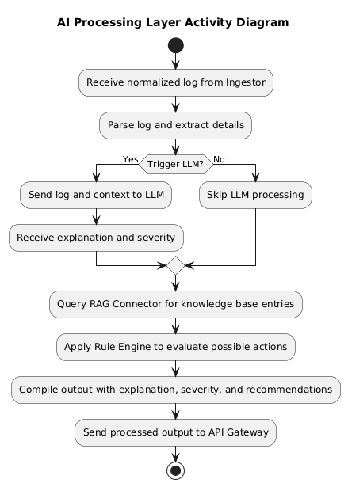
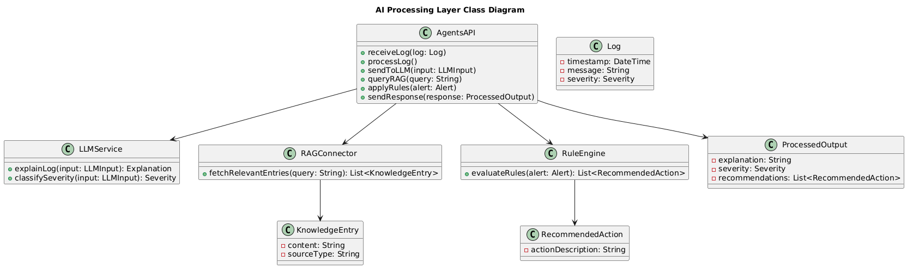
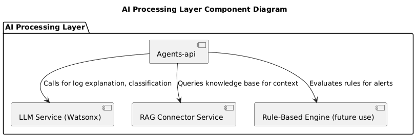
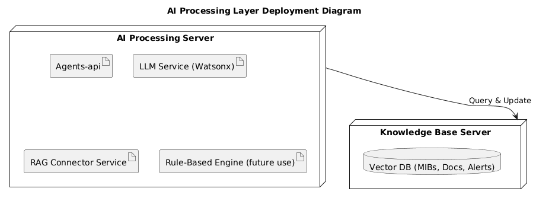
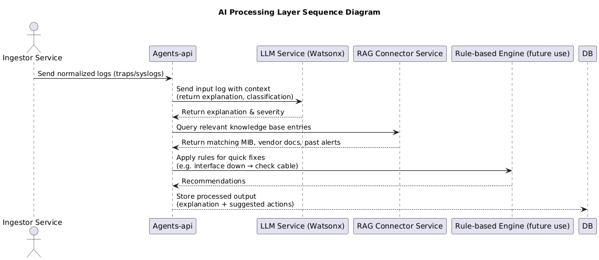
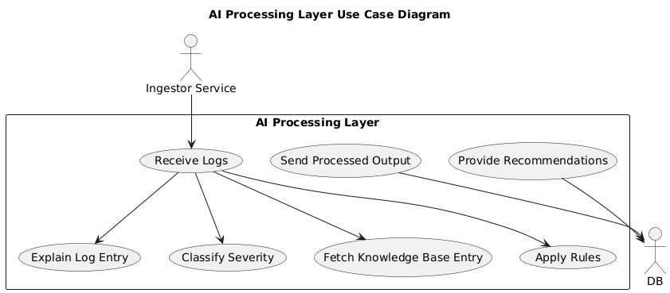

Core AI intelligent processing components including Agents-api REST interface, LLM Service integration for natural language log explanation and severity classification, RAG Connector for knowledge base retrieval, and Rule-Based Engine for alert validation and remediation suggestions.

### UML Diagrams in this folder:

#### Activity.puml

#### Class.puml

#### Component.puml

#### Deployment.puml

#### Sequence.puml

#### UseCase.puml

