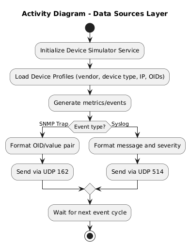
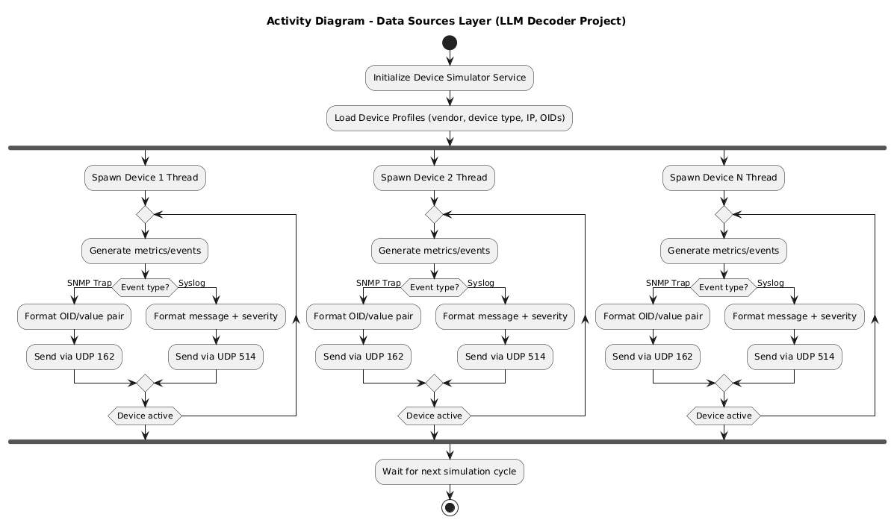
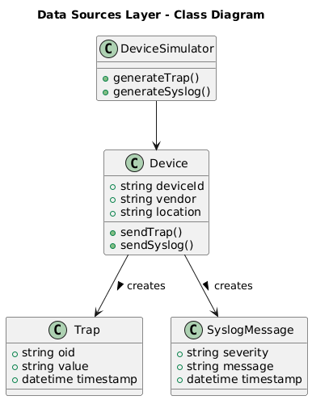
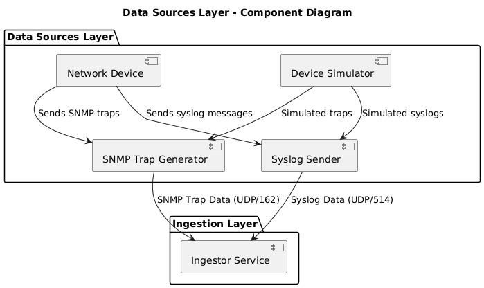
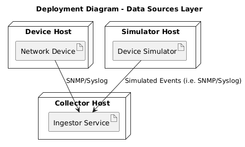
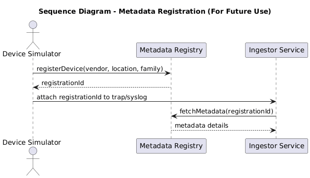
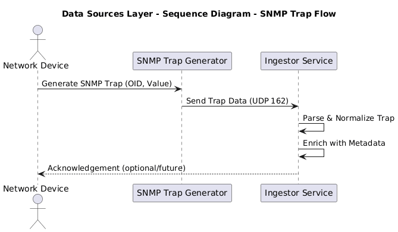
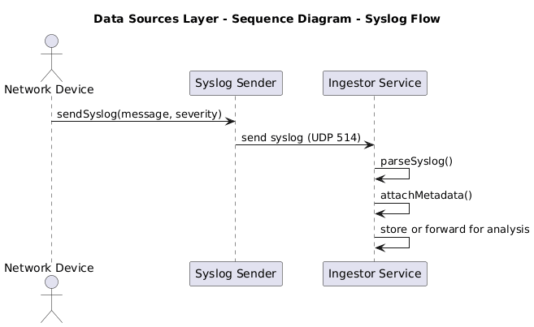
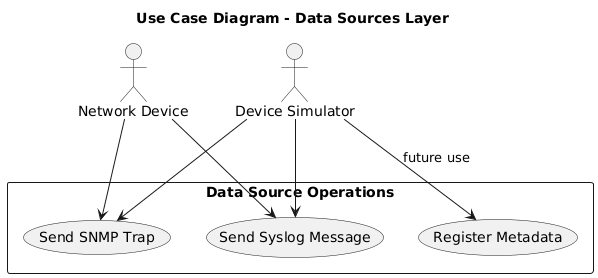

Data source adapters and simulators responsible for capturing SNMP traps, syslogs, and device metadata. Includes parsers for raw network device outputs and tools for emulating device behavior during testing.

### UML Diagrams in this folder:

#### Activity.puml

#### ActivityMultipleDevice.puml

#### Class.puml

#### Component.puml

#### Deployment.puml

#### SequenceMetadataRegistrationFlow.puml

#### SequenceSNMPTrapFlow.puml

#### SequenceSysLogFlow.puml

#### UseCase.puml

