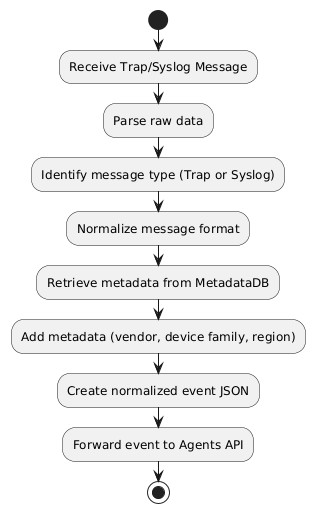
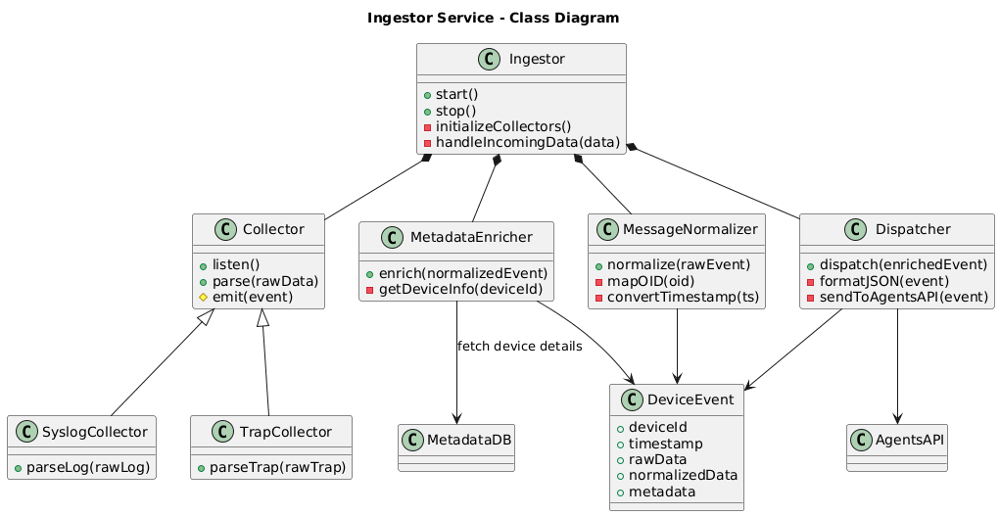
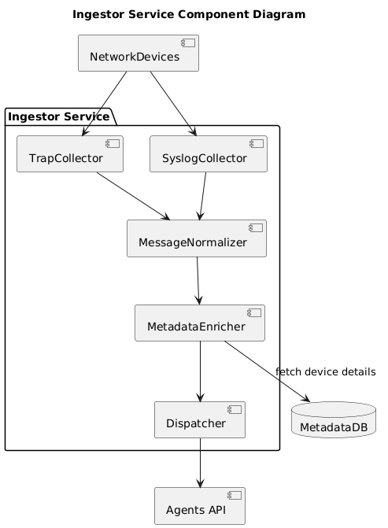
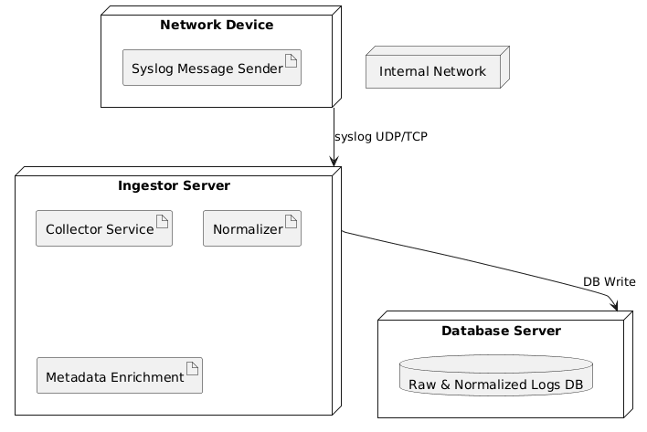
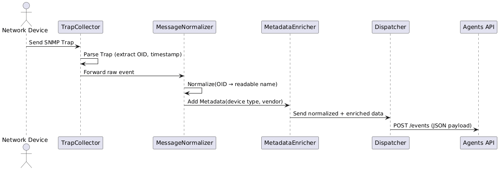
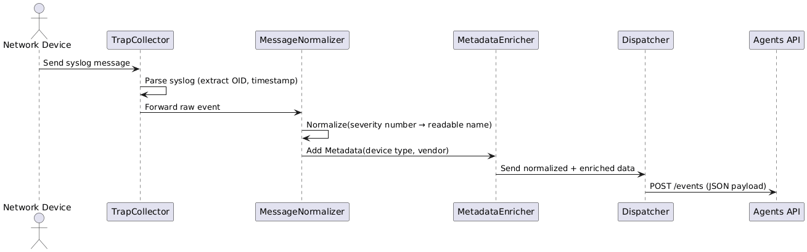
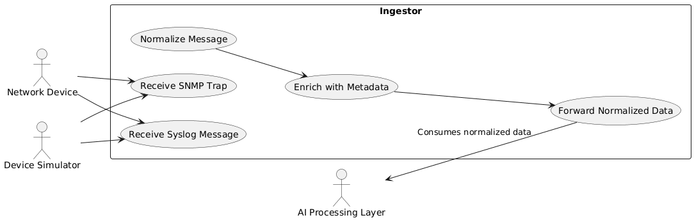

Collector and ingestion services that receive and normalize raw logs from the DataSource layer. Handles timestamp normalization, OID to friendly name mapping, device metadata enrichment, and batching of logs for efficient downstream processing.

**Security hardening (2026-07-16):**
- Hardcoded HMAC fallback removed from OAuth state computation — app panics if `JWT_SECRET` is absent
- `GIN_MODE` defaults to `release` — stack traces no longer leak in HTTP error responses
- 4 MB request body cap via `RequestBodyLimit` middleware — prevents DoS via oversized payloads
- PostgreSQL `sslmode` defaults to `require`; override with `POSTGRES_SSLMODE=disable` for local dev
- `ChangePassword` enforces full password strength (uppercase + digit + special char)
- `SetTrustedProxies` reads `TRUSTED_PROXIES` env var — prevents IP spoofing bypass of rate limiter

### UML Diagrams in this folder:

#### Activity.puml

#### Class.puml

#### Component.puml

#### Deployment.puml

#### SequenceSNMPTrapFlow.puml

#### SequenceSysLogFlow.puml

#### UseCase.puml

