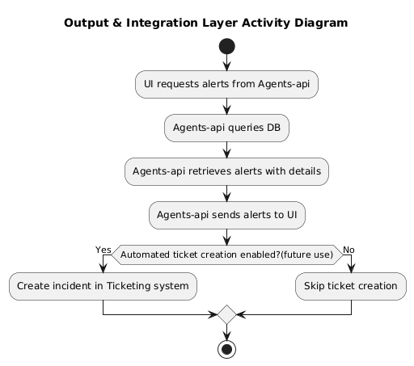
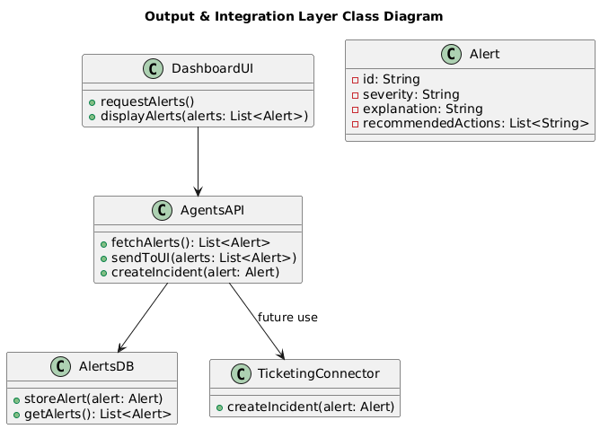
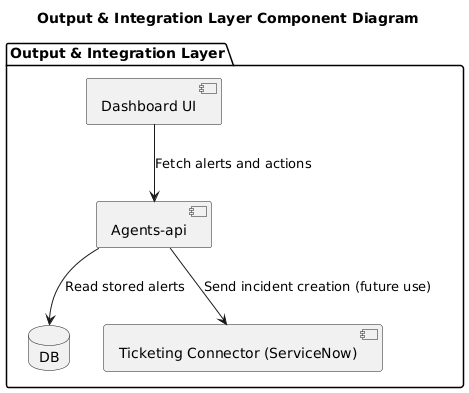
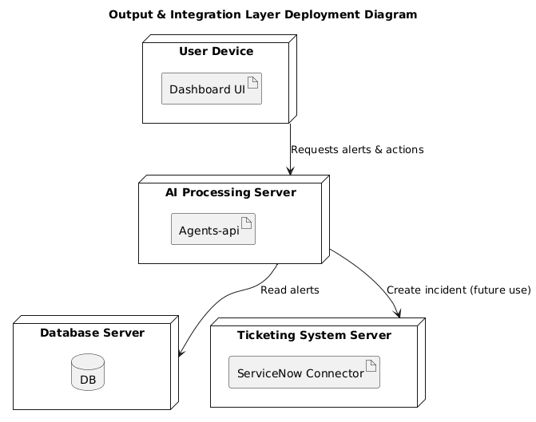
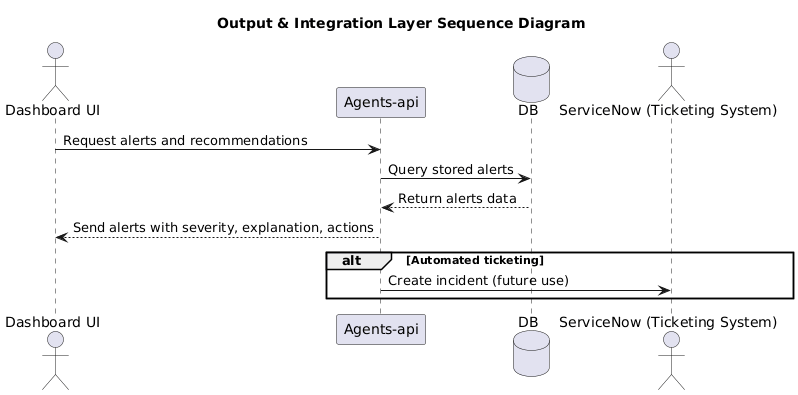
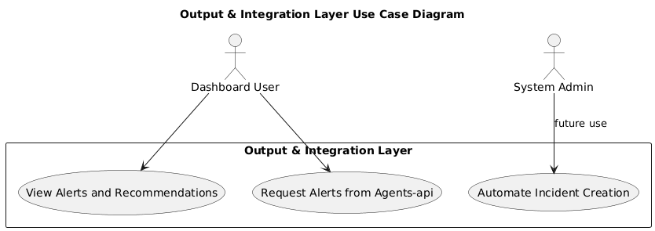

Services handling storage of processed alerts and integration with user-facing components. Hosts the Agents-api endpoints for the UI to fetch alerts, manages the Alerts DB, and supports integration connectors such as automatic incident creation in ticketing systems like ServiceNow.

### UML Diagrams in this folder:

#### Activity.puml

#### Class.puml

#### Component.puml

#### Deployment.puml

#### Sequence.puml

#### UseCase.puml

